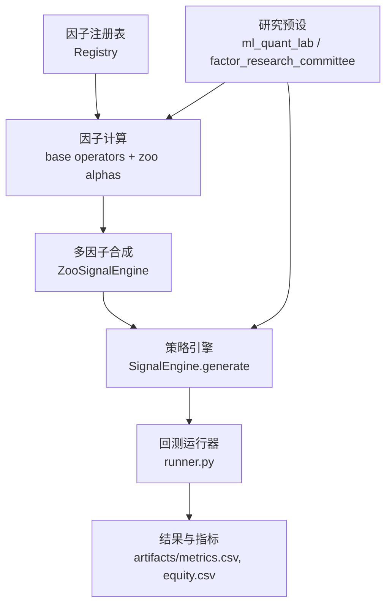
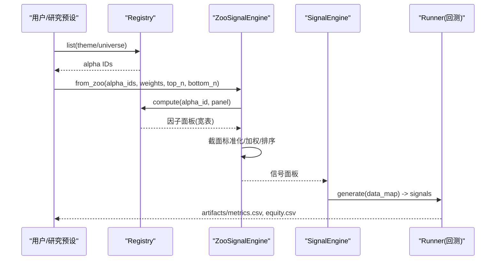
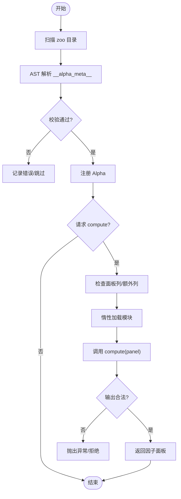
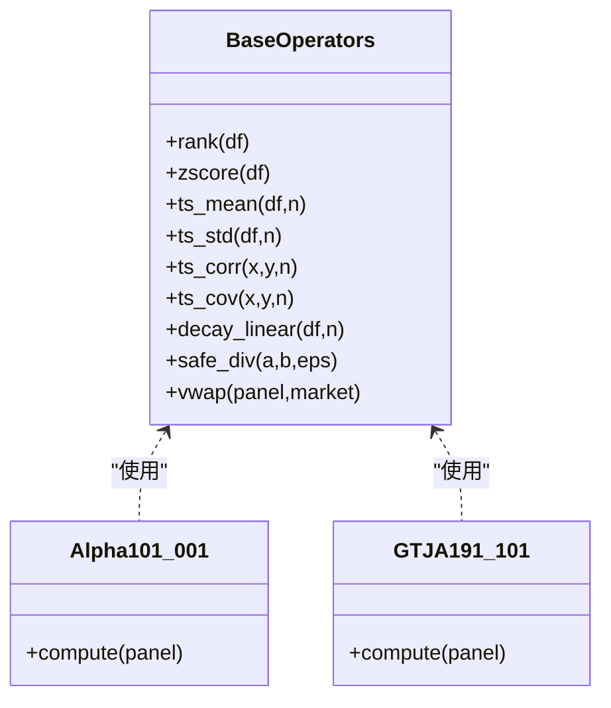
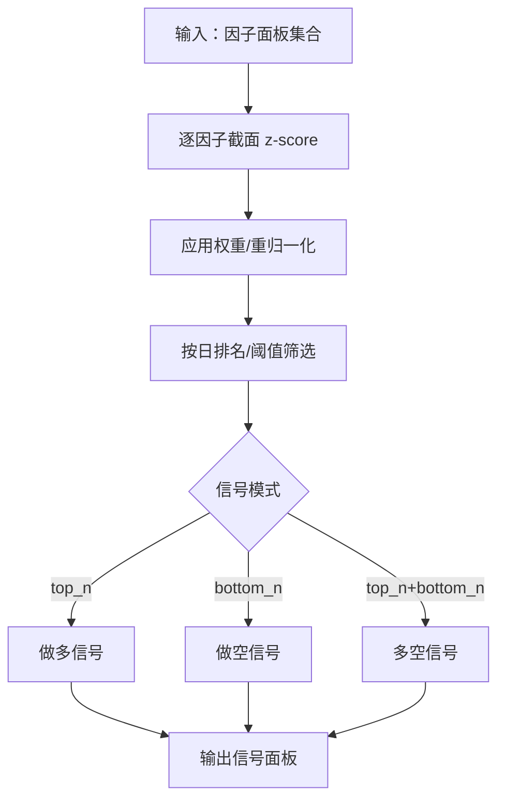
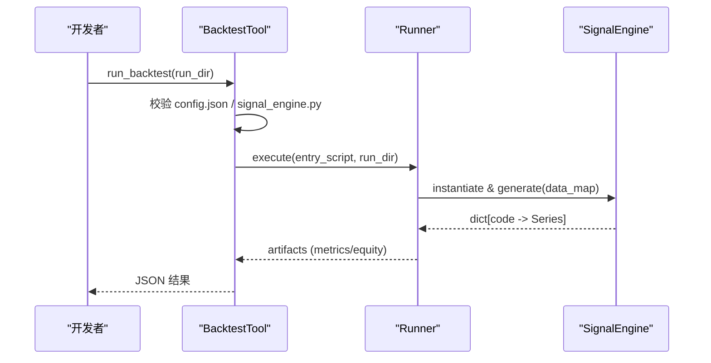
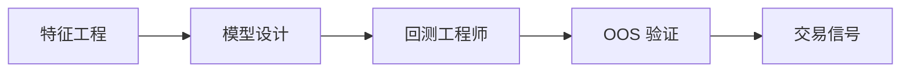
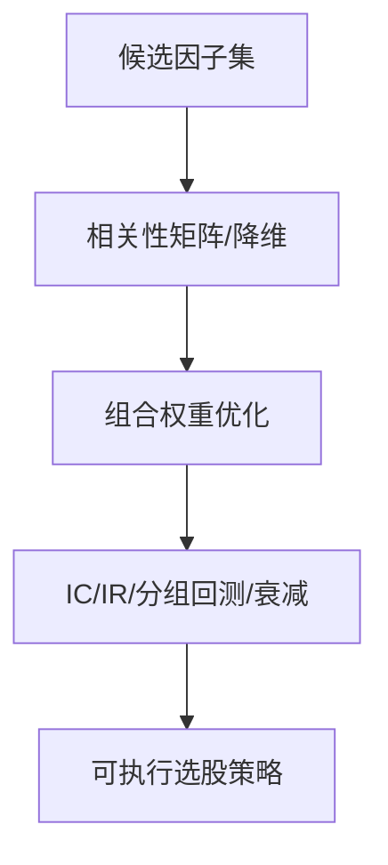
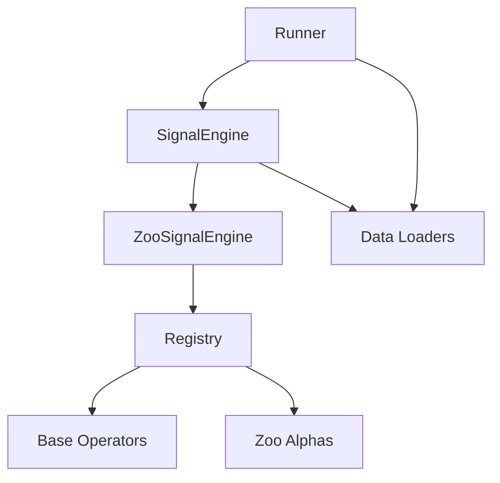
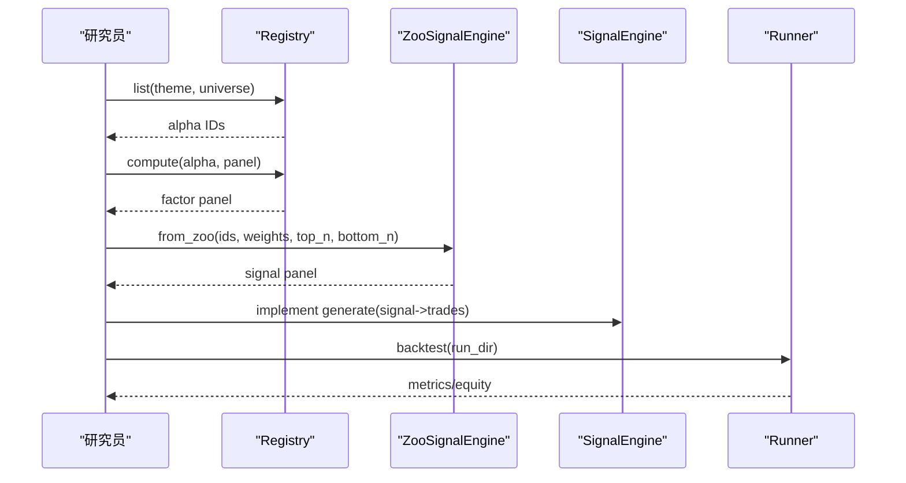

# 信号生成系统

<cite>
**本文引用的文件**
- [README.md](file://README.md)
- [registry.py](file://agent/src/factors/registry.py)
- [base.py](file://agent/src/factors/base.py)
- [zoo_signal_engine.py](file://agent/src/skills/multi-factor/zoo_signal_engine.py)
- [SKILL.md（因子研究）](file://agent/src/skills/factor-research/SKILL.md)
- [SKILL.md（多因子）](file://agent/src/skills/multi-factor/SKILL.md)
- [alpha_001.py（Alpha101 #1）](file://agent/src/factors/zoo/alpha101/alpha_001.py)
- [alpha_101.py（GTJA191 #101）](file://agent/src/factors/zoo/gtja191/alpha_101.py)
- [alpha_121.py（GTJA191 #121）](file://agent/src/factors/zoo/gtja191/alpha_121.py)
- [alpha_141.py（GTJA191 #141）](file://agent/src/factors/zoo/gtja191/alpha_141.py)
- [alpha_181.py（GTJA191 #181）](file://agent/src/factors/zoo/gtja191/alpha_181.py)
- [alpha_191.py（GTJA191 #191）](file://agent/src/factors/zoo/gtja191/alpha_191.py)
- [backtest_tool.py](file://agent/src/tools/backtest_tool.py)
- [runner.py（回测入口）](file://agent/backtest/runner.py)
- [context.py（任务路由）](file://agent/src/agent/context.py)
- [ml_quant_lab.yaml](file://agent/src/swarm/presets/ml_quant_lab.yaml)
- [factor_research_committee.yaml](file://agent/src/swarm/presets/factor_research_committee.yaml)
</cite>

## 目录
1. [简介](#简介)
2. [项目结构](#项目结构)
3. [核心组件](#核心组件)
4. [架构总览](#架构总览)
5. [详细组件分析](#详细组件分析)
6. [依赖关系分析](#依赖关系分析)
7. [性能考量](#性能考量)
8. [故障排查指南](#故障排查指南)
9. [结论](#结论)
10. [附录：实战案例与最佳实践](#附录：实战案例与最佳实践)

## 简介
本文件系统性地文档化“信号生成系统”的完整工作流，覆盖技术指标计算、因子构建、机器学习模型集成、信号标准化/过滤/组合机制，以及内置 460+ 因子库（Alpha101、GTJA191、学术因子等）的使用方法。同时给出自定义因子的开发流程（数据获取、计算逻辑、有效性检验）、信号质量评估方法与优化技巧，并通过实际案例演示如何构建有效的交易信号。

## 项目结构
信号生成系统围绕“因子注册与计算—多因子合成—策略引擎—回测验证—评估归因”的主线组织：
- 因子层：通过 AST 扫描 zoo 目录，解析每个因子的元数据并注册；运行时惰性加载 compute 函数，输出宽面板 DataFrame。
- 合成层：ZooSignalEngine 对多个因子进行截面标准化、加权、排序，输出长/短或多空信号。
- 策略层：SignalEngine 是回测器契约类，generate(data_map) 返回每标的的信号序列。
- 回测层：backtest runner 读取配置、选择数据源、导入 SignalEngine 执行回测，产出指标与权益曲线。
- 研究与自动化：Swarm 预设驱动因子研究、特征工程与 ML 建模，最终落地为可回测的策略。

图表来源
- [registry.py:201-397](file://agent/src/factors/registry.py#L201-L397)
- [base.py:62-356](file://agent/src/factors/base.py#L62-L356)
- [zoo_signal_engine.py:43-87](file://agent/src/skills/multi-factor/zoo_signal_engine.py#L43-L87)
- [backtest_tool.py:15-74](file://agent/src/tools/backtest_tool.py#L15-L74)
- [runner.py:1-42](file://agent/backtest/runner.py#L1-L42)

章节来源
- [README.md:1-166](file://README.md#L1-L166)

## 核心组件
- 因子注册表 Registry：AST 静态解析 zoo 模块中的 __alpha_meta__，校验字段、主题、市场、频率、最小预热期等；compute 时惰性加载模块并执行 compute(panel)，严格校验输出形状、无穷值与 NaN 比例。
- 基础算子 base：提供 rank、zscore、ts_mean/std/corr/cov、decay_linear、safe_div、vwap 等高性能向量化工具，统一 NaN 传播与前瞻禁止约束。
- 多因子合成 ZooSignalEngine：按日期做截面 z-score，支持等权或自定义权重，top_n/bottom_n 实现做多/做空/多空信号，自动重分配存活因子权重。
- 策略引擎 SignalEngine：回测契约类，generate(data_map) 输入 OHLCV/因子面板，输出每标的信号序列。
- 回测运行器 runner：读取 config.json，选择数据源，导入 signal_engine.py 执行，产出 artifacts。
- 研究预设：ml_quant_lab 与 factor_research_committee 驱动端到端的研究流水线（特征工程→模型设计→回测工程师）。

章节来源
- [registry.py:87-125](file://agent/src/factors/registry.py#L87-L125)
- [registry.py:201-397](file://agent/src/factors/registry.py#L201-L397)
- [base.py:62-356](file://agent/src/factors/base.py#L62-L356)
- [zoo_signal_engine.py:43-87](file://agent/src/skills/multi-factor/zoo_signal_engine.py#L43-L87)
- [backtest_tool.py:15-74](file://agent/src/tools/backtest_tool.py#L15-L74)
- [runner.py:1-42](file://agent/backtest/runner.py#L1-L42)

## 架构总览
下图展示从因子到信号的端到端调用链，包括注册、计算、合成、回测与评估。

图表来源
- [registry.py:264-355](file://agent/src/factors/registry.py#L264-L355)
- [zoo_signal_engine.py:43-87](file://agent/src/skills/multi-factor/zoo_signal_engine.py#L43-L87)
- [backtest_tool.py:15-74](file://agent/src/tools/backtest_tool.py#L15-L74)
- [runner.py:1-42](file://agent/backtest/runner.py#L1-L42)

## 详细组件分析

### 因子注册与计算（Registry）
- 扫描 zoo 目录，AST 提取 __alpha_meta__，校验字段合法性（主题、市场、频率、列依赖、预热期等）。
- 计算路径：检查面板必需列 → 惰性 import 模块 → 调用 compute(panel) → 校验输出形状、无穷值与 NaN 比例。
- 健康检查与清单导出：health() 统计加载/失败/错误；export_manifest() 供外部消费。

图表来源
- [registry.py:219-260](file://agent/src/factors/registry.py#L219-L260)
- [registry.py:321-397](file://agent/src/factors/registry.py#L321-L397)

章节来源
- [registry.py:87-125](file://agent/src/factors/registry.py#L87-L125)
- [registry.py:219-397](file://agent/src/factors/registry.py#L219-L397)

### 基础算子与因子实现（base + zoo alphas）
- 基础算子：rank、zscore、scale、ts_rank、ts_corr/ts_cov、ts_mean/std/max/min、delta、decay_linear、signed_power、safe_div、vwap（市场感知）。
- 因子示例：
  - Alpha101 #1：基于收益条件波动与时间序极值的动量信号。
  - GTJA191 #101/#121/#141/#181/#191：涵盖量价、相关性、波动率等经典构造。
- 所有因子遵循宽面板输入输出、NaN 传播、无前瞻、无无穷值约定。

图表来源
- [base.py:62-356](file://agent/src/factors/base.py#L62-L356)
- [alpha_001.py:38-64](file://agent/src/factors/zoo/alpha101/alpha_001.py#L38-L64)
- [alpha_101.py:40-68](file://agent/src/factors/zoo/gtja191/alpha_101.py#L40-L68)

章节来源
- [base.py:62-356](file://agent/src/factors/base.py#L62-L356)
- [alpha_001.py:38-64](file://agent/src/factors/zoo/alpha101/alpha_001.py#L38-L64)
- [alpha_101.py:40-68](file://agent/src/factors/zoo/gtja191/alpha_101.py#L40-L68)
- [alpha_121.py:39-67](file://agent/src/factors/zoo/gtja191/alpha_121.py#L39-L67)
- [alpha_141.py:39-65](file://agent/src/factors/zoo/gtja191/alpha_141.py#L39-L65)
- [alpha_181.py:39-57](file://agent/src/factors/zoo/gtja191/alpha_181.py#L39-L57)
- [alpha_191.py:39-67](file://agent/src/factors/zoo/gtja191/alpha_191.py#L39-L67)

### 多因子合成（ZooSignalEngine）
- 截面标准化：按日对每个因子做 z-score，消除尺度差异。
- 权重分配：支持等权或自定义权重；当部分因子被跳过时，对存活因子重新归一化权重。
- 信号模式：top_n（做多）、bottom_n（做空）、top_n+bottom_n（多空），输出与 close 同形的信号面板。

图表来源
- [zoo_signal_engine.py:43-87](file://agent/src/skills/multi-factor/zoo_signal_engine.py#L43-L87)
- [SKILL.md（多因子）:59-77](file://agent/src/skills/multi-factor/SKILL.md#L59-L77)

章节来源
- [zoo_signal_engine.py:43-87](file://agent/src/skills/multi-factor/zoo_signal_engine.py#L43-L87)
- [SKILL.md（多因子）:59-77](file://agent/src/skills/multi-factor/SKILL.md#L59-L77)

### 策略引擎与回测（SignalEngine + Runner）
- SignalEngine.generate：接收 data_map（OHLCV/因子面板），返回每标的信号序列。
- backtest_tool：校验 config.json 与 signal_engine.py，调用 runner 执行回测，收集 artifacts。
- runner：根据 source/auto 选择数据源，导入 signal_engine，执行回测并产出指标与权益曲线。

图表来源
- [backtest_tool.py:15-74](file://agent/src/tools/backtest_tool.py#L15-L74)
- [runner.py:1-42](file://agent/backtest/runner.py#L1-L42)

章节来源
- [backtest_tool.py:15-74](file://agent/src/tools/backtest_tool.py#L15-L74)
- [runner.py:1-42](file://agent/backtest/runner.py#L1-L42)

### 机器学习模型集成（ML Lab 预设）
- 特征工程：技术面、基本面、交叉项、替代数据；强调点-in-time 对齐、去相关、缩尾、截面标准化。
- 模型设计：首选树模型/线性基线，明确 CV 计划、正则化、评估指标（ICIR、年化收益等）。
- 回测工程师：将模型输出转化为可回测规则，严格 OOS 验证。

图表来源
- [ml_quant_lab.yaml:1-39](file://agent/src/swarm/presets/ml_quant_lab.yaml#L1-L39)
- [ml_quant_lab.yaml:61-83](file://agent/src/swarm/presets/ml_quant_lab.yaml#L61-L83)

章节来源
- [ml_quant_lab.yaml:1-39](file://agent/src/swarm/presets/ml_quant_lab.yaml#L1-L39)
- [ml_quant_lab.yaml:61-83](file://agent/src/swarm/presets/ml_quant_lab.yaml#L61-L83)

### 因子研究委员会（多因子组合）
- 因子候选：列出公式与经济逻辑，预估 IC 方向与幅度，预览相关性避免重叠。
- 验证框架：IC/IR/t 检验、五分组回测、衰减与容量分析、换手率与成本敏感性。
- 组合方法：相关性管理、正交化/PCA、线性与非线性组合，输出可执行的选股策略。

图表来源
- [factor_research_committee.yaml:41-79](file://agent/src/swarm/presets/factor_research_committee.yaml#L41-L79)
- [factor_research_committee.yaml:103-118](file://agent/src/swarm/presets/factor_research_committee.yaml#L103-L118)

章节来源
- [factor_research_committee.yaml:41-79](file://agent/src/swarm/presets/factor_research_committee.yaml#L41-L79)
- [factor_research_committee.yaml:103-118](file://agent/src/swarm/presets/factor_research_committee.yaml#L103-L118)

## 依赖关系分析
- 组件耦合：
  - Registry 依赖 base 算子与 zoo 因子模块；compute 时动态加载，隔离失败。
  - ZooSignalEngine 依赖 Registry 提供的因子面板，内部做截面标准化与权重分配。
  - SignalEngine 依赖数据源与因子面板，输出信号给 Runner。
  - Runner 依赖 backtest 工具链与数据源注册表。
- 外部依赖：
  - 数据源：多种 loader（tushare/yfinance/akshare 等），通过 registry 与 fallback chain 路由。
  - LLM/Agent：通过 context 的任务路由驱动策略生成与回测。

图表来源
- [registry.py:201-397](file://agent/src/factors/registry.py#L201-L397)
- [base.py:62-356](file://agent/src/factors/base.py#L62-L356)
- [zoo_signal_engine.py:43-87](file://agent/src/skills/multi-factor/zoo_signal_engine.py#L43-L87)
- [backtest_tool.py:15-74](file://agent/src/tools/backtest_tool.py#L15-L74)
- [runner.py:1-42](file://agent/backtest/runner.py#L1-L42)

章节来源
- [registry.py:201-397](file://agent/src/factors/registry.py#L201-L397)
- [base.py:62-356](file://agent/src/factors/base.py#L62-L356)
- [zoo_signal_engine.py:43-87](file://agent/src/skills/multi-factor/zoo_signal_engine.py#L43-L87)
- [backtest_tool.py:15-74](file://agent/src/tools/backtest_tool.py#L15-L74)
- [runner.py:1-42](file://agent/backtest/runner.py#L1-L42)

## 性能考量
- 向量化与缓存：
  - base 中大量使用 numpy/bottleneck 滑动窗口与 einsum，显著加速 rolling/rank/argmax 等操作。
  - Registry 进程级单例缓存，避免重复 AST 扫描。
- 惰性加载与隔离：
  - 因子模块仅在 compute 时加载，失败隔离不影响其他因子。
- 面板操作：
  - 宽面板（date × instrument）减少循环开销；截面标准化与排序在行维度高效完成。
- 建议：
  - 控制因子数量与窗口长度，避免过大内存占用。
  - 利用 Registry.list 按主题/市场筛选，减少不必要计算。
  - 对高频因子考虑分块/并行批处理。

[本节为通用指导，不直接分析具体文件]

## 故障排查指南
- 因子计算失败：
  - 检查面板是否缺少必需列或 extras_required；确认 requires_sector 是否满足。
  - 若输出包含 +/- inf 或 NaN 比例 >95%，将被拒绝；需检查除零、常数序列、窗口不足等问题。
- 回测失败：
  - 确认 config.json 存在且 source 有效；signal_engine.py 必须包含 SignalEngine 与 generate 方法。
  - 查看 artifacts 与 stdout/stderr 定位错误。
- 研究预设问题：
  - 检查 agent 上下文路由是否正确加载技能；确保工具调用成功。

章节来源
- [registry.py:321-397](file://agent/src/factors/registry.py#L321-L397)
- [backtest_tool.py:15-74](file://agent/src/tools/backtest_tool.py#L15-L74)
- [context.py:73-91](file://agent/src/agent/context.py#L73-L91)

## 结论
该系统以“因子注册—计算—合成—策略—回测—评估”为主线，提供了高内聚、低耦合的可扩展信号生成平台。通过严格的元数据校验、高性能算子、稳健的多因子合成与严谨的回测流程，能够支撑从经典因子到机器学习模型的多样化信号构建需求。结合研究预设与自动化工作流，用户可以快速迭代、验证并部署高质量交易信号。

[本节为总结性内容，不直接分析具体文件]

## 附录：实战案例与最佳实践

### 使用内置 460+ 因子库
- 浏览与筛选：通过 Registry.list(theme="momentum", universe="equity_cn") 获取候选因子 ID。
- 计算因子面板：registry.compute("alpha101_001", panel) 得到与 close 同形的因子面板。
- 组合信号：使用 ZooSignalEngine.from_zoo(alpha_ids, standardize=True, top_n=10, bottom_n=10) 生成多空信号。

章节来源
- [SKILL.md（因子研究）:142-157](file://agent/src/skills/factor-research/SKILL.md#L142-L157)
- [SKILL.md（多因子）:59-77](file://agent/src/skills/multi-factor/SKILL.md#L59-L77)
- [registry.py:264-355](file://agent/src/factors/registry.py#L264-L355)

### 自定义因子开发流程
- 数据获取：确保面板包含 columns_required 与 extras_required 字段；A 股注意 amount/volume 单位与 VWAP 计算。
- 计算逻辑：基于 base 算子实现，遵守 NaN 传播与前瞻禁止；输出宽面板 DataFrame。
- 有效性检验：使用 factor_analysis 工具计算 IC 系列、分组回测、衰减曲线；参考 IC/IR 标准判断有效性。

章节来源
- [base.py:365-399](file://agent/src/factors/base.py#L365-L399)
- [SKILL.md（因子研究）:38-140](file://agent/src/skills/factor-research/SKILL.md#L38-L140)

### 信号质量评估与优化技巧
- 评估指标：IC mean、IR、IC>0 比例、分组单调性、long-short spread、衰减半衰期、换手率。
- 优化技巧：截面标准化、行业中性化、相关性管理（PCA/正交化）、权重再归一化、过拟合防护（正则化、滚动 CV）。
- 回测验证：确保 artifacts 完整（metrics.csv、equity.csv），交易次数>0，无 NaN 权益曲线。

章节来源
- [SKILL.md（因子研究）:38-140](file://agent/src/skills/factor-research/SKILL.md#L38-L140)
- [backtest_tool.py:15-74](file://agent/src/tools/backtest_tool.py#L15-L74)

### 端到端案例：从因子到策略
- 步骤：
  1) 选择因子：Registry.list 筛选主题与市场。
  2) 计算面板：registry.compute 得到因子面板。
  3) 合成信号：ZooSignalEngine 标准化与加权，输出信号。
  4) 编写策略：SignalEngine.generate 将信号转为交易规则。
  5) 回测验证：backtest_tool 运行 runner，检查 artifacts。
  6) 评估优化：基于 IC/IR/分组回测调整因子与权重。

图表来源
- [registry.py:264-355](file://agent/src/factors/registry.py#L264-L355)
- [zoo_signal_engine.py:43-87](file://agent/src/skills/multi-factor/zoo_signal_engine.py#L43-L87)
- [backtest_tool.py:15-74](file://agent/src/tools/backtest_tool.py#L15-L74)
- [runner.py:1-42](file://agent/backtest/runner.py#L1-L42)