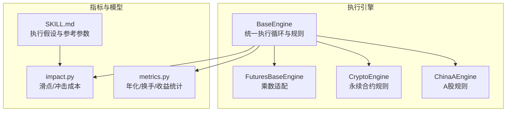
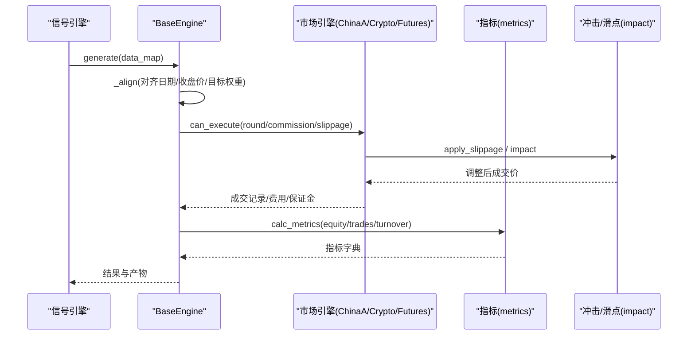
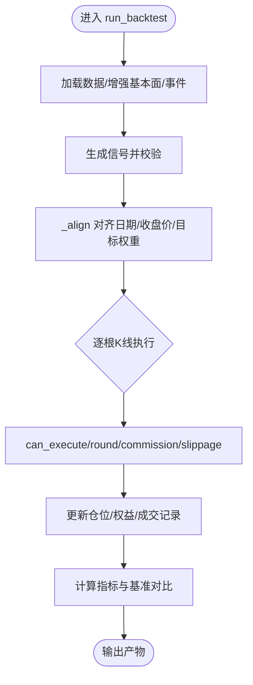
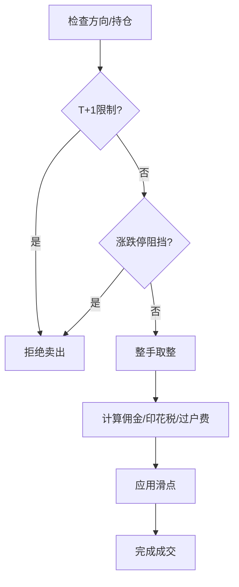
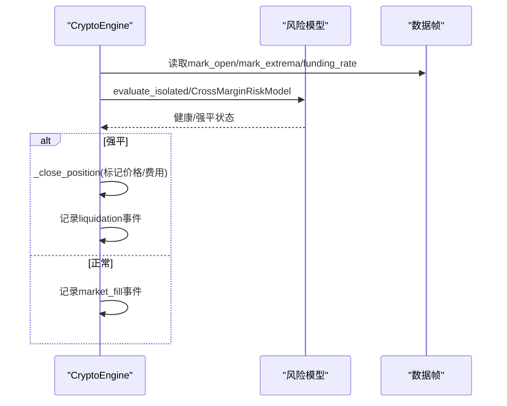
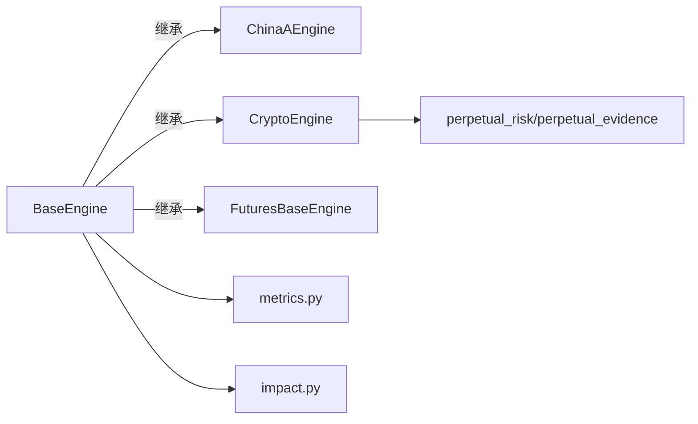

# 执行算法

<cite>
**本文引用的文件**
- [agent/backtest/engines/base.py](file://agent/backtest/engines/base.py)
- [agent/backtest/metrics.py](file://agent/backtest/metrics.py)
- [agent/backtest/engines/china_a.py](file://agent/backtest/engines/china_a.py)
- [agent/backtest/engines/crypto.py](file://agent/backtest/engines/crypto.py)
- [agent/backtest/engines/futures_base.py](file://agent/backtest/engines/futures_base.py)
- [agent/src/skills/execution-model/SKILL.md](file://agent/src/skills/execution-model/SKILL.md)
- [agent/src/quantlib/impact.py](file://agent/src/quantlib/impact.py)
</cite>

## 目录
1. [简介](#简介)
2. [项目结构](#项目结构)
3. [核心组件](#核心组件)
4. [架构总览](#架构总览)
5. [详细组件分析](#详细组件分析)
6. [依赖关系分析](#依赖关系分析)
7. [性能与成本考量](#性能与成本考量)
8. [故障排查指南](#故障排查指南)
9. [结论](#结论)
10. [附录](#附录)

## 简介
本文件面向“订单执行策略”的专业文档，围绕回测引擎中的执行层展开，覆盖以下主题：
- 执行算法与策略：TWAP、VWAP、冰山订单、狙击单等（概念性说明与落地建议）
- 滑点控制与交易成本优化方法
- 流动性管理与冲击成本估算
- 不同市场执行特性：A股、美股、期货、加密货币
- 执行效果评估指标与优化方法
- 与券商接口集成的实现要点（基于现有回测抽象的对接思路）

本仓库提供了统一的基础执行框架与多市场引擎实现，可作为实盘或回测中执行策略的参考基线。

## 项目结构
执行相关代码主要位于回测引擎模块与量化库工具中：
- 基础执行引擎：提供统一的逐根K线执行循环、价格限制、滑点、佣金、仓位调整钩子等
- 市场特定引擎：A股、加密货币永续合约、期货（通过期货基类扩展）
- 指标与度量：年化因子、换手率、收益统计、基准对比等
- 执行模型与冲击成本：线性/平方根冲击模型、按市场参考滑点与影响系数

图表来源
- [agent/backtest/engines/base.py:377-650](file://agent/backtest/engines/base.py#L377-L650)
- [agent/backtest/engines/china_a.py:20-93](file://agent/backtest/engines/china_a.py#L20-L93)
- [agent/backtest/engines/crypto.py:41-139](file://agent/backtest/engines/crypto.py#L41-L139)
- [agent/backtest/engines/futures_base.py:19-57](file://agent/backtest/engines/futures_base.py#L19-L57)
- [agent/backtest/metrics.py:153-171](file://agent/backtest/metrics.py#L153-L171)
- [agent/src/quantlib/impact.py:154-191](file://agent/src/quantlib/impact.py#L154-L191)
- [agent/src/skills/execution-model/SKILL.md:47-80](file://agent/src/skills/execution-model/SKILL.md#L47-L80)

章节来源
- [agent/backtest/engines/base.py:377-650](file://agent/backtest/engines/base.py#L377-L650)
- [agent/backtest/metrics.py:153-171](file://agent/backtest/metrics.py#L153-L171)

## 核心组件
- 基础执行引擎（BaseEngine）
  - 统一执行流程：数据加载 → 信号生成 → 目标权重预计算 → 逐根K线执行 → 指标输出
  - 可插拔市场规则：can_execute、round_size、calc_commission、apply_slippage、on_bar
  - 价格限制与滑点：limit_band、prospective_fill_price、historical_base_price
  - 杠杆与保证金：_calc_pnl、_calc_margin、_calc_raw_size、_leverage_for_symbol
- A股引擎（ChinaAEngine）
  - T+1、禁止融券、涨跌停板、最小整手、佣金/印花税/过户费、滑点
- 加密货币引擎（CryptoEngine）
  - 24/7交易、Maker/Taker费率、资金费率结算、强平逻辑、严格模式下的风险快照与事件记录
- 期货基类（FuturesBaseEngine）
  - 合约乘数对PnL、保证金、头寸规模的影响
- 指标与度量（metrics.py）
  - 年化因子映射、换手率、收益统计、基准对比、跟踪误差与信息比率
- 执行模型与冲击成本（impact.py, SKILL.md）
  - 固定滑点与线性/平方根冲击模型；按市场参考滑点与影响系数

章节来源
- [agent/backtest/engines/base.py:377-650](file://agent/backtest/engines/base.py#L377-L650)
- [agent/backtest/engines/china_a.py:20-93](file://agent/backtest/engines/china_a.py#L20-L93)
- [agent/backtest/engines/crypto.py:41-139](file://agent/backtest/engines/crypto.py#L41-L139)
- [agent/backtest/engines/futures_base.py:19-57](file://agent/backtest/engines/futures_base.py#L19-L57)
- [agent/backtest/metrics.py:153-171](file://agent/backtest/metrics.py#L153-L171)
- [agent/src/quantlib/impact.py:154-191](file://agent/src/quantlib/impact.py#L154-L191)
- [agent/src/skills/execution-model/SKILL.md:47-80](file://agent/src/skills/execution-model/SKILL.md#L47-L80)

## 架构总览
下图展示从信号到执行的完整链路，以及各市场引擎如何复用基础能力并注入市场规则。

图表来源
- [agent/backtest/engines/base.py:652-724](file://agent/backtest/engines/base.py#L652-L724)
- [agent/backtest/metrics.py:461-626](file://agent/backtest/metrics.py#L461-L626)
- [agent/backtest/engines/china_a.py:40-93](file://agent/backtest/engines/china_a.py#L40-L93)
- [agent/backtest/engines/crypto.py:111-142](file://agent/backtest/engines/crypto.py#L111-L142)
- [agent/src/quantlib/impact.py:154-191](file://agent/src/quantlib/impact.py#L154-L191)

## 详细组件分析

### 基础执行引擎（BaseEngine）
- 职责
  - 统一执行循环：run_backtest负责数据加载、信号生成、目标权重对齐、逐根K线执行、指标计算与产物输出
  - 市场规则抽象：can_execute、round_size、calc_commission、apply_slippage、on_bar
  - 价格限制与滑点：limit_band、prospective_fill_price、historical_base_price
  - 头寸与保证金：_calc_pnl、_calc_margin、_calc_raw_size、_leverage_for_symbol
- 关键设计
  - 使用“前向填充+限制步长”对齐跨市场日历，避免长时间停牌导致的数据缺失
  - 以“开盘价+滑点”作为拟成交价，结合历史基准价计算涨跌停带，避免未来函数
  - 支持外部基准序列与基准元数据，统一计算超额收益、信息比率、跟踪误差

图表来源
- [agent/backtest/engines/base.py:652-724](file://agent/backtest/engines/base.py#L652-L724)
- [agent/backtest/engines/base.py:570-711](file://agent/backtest/engines/base.py#L570-L711)

章节来源
- [agent/backtest/engines/base.py:377-650](file://agent/backtest/engines/base.py#L377-L650)
- [agent/backtest/engines/base.py:652-724](file://agent/backtest/engines/base.py#L652-L724)

### A股执行引擎（ChinaAEngine）
- 市场规则
  - T+1：当日买入不可卖出
  - 禁止融券做空
  - 涨跌停板：主板±10%，创业板/科创板±20%，ST±5%（启发式）
  - 最小整手：100股
  - 费用：佣金（最低5元）、印花税（仅卖出）、过户费
  - 滑点：相对较小
- 执行细节
  - 通过limit_band与prospective_fill_price判断是否被涨跌停阻挡
  - round_size向下取整至100股倍数
  - apply_slippage按方向施加比例滑点

图表来源
- [agent/backtest/engines/china_a.py:40-93](file://agent/backtest/engines/china_a.py#L40-L93)
- [agent/backtest/engines/china_a.py:98-154](file://agent/backtest/engines/china_a.py#L98-L154)

章节来源
- [agent/backtest/engines/china_a.py:20-93](file://agent/backtest/engines/china_a.py#L20-L93)
- [agent/backtest/engines/china_a.py:98-154](file://agent/backtest/engines/china_a.py#L98-L154)

### 加密货币永续合约引擎（CryptoEngine）
- 市场规则
  - 24/7交易，方向无限制
  - Maker/Taker费率分离
  - 资金费率结算（每8小时），严格模式下需数据驱动
  - 强平：维持保证金比率阈值触发
  - 支持分数仓
- 执行细节
  - 严格模式下构建MarketRiskFrame，进行事前/事后风险评估与强平
  - 记录funding_settlement、market_fill、position_liquidation、account_liquidation等事件
  - 隔离/全仓模式差异化管理保证金

图表来源
- [agent/backtest/engines/crypto.py:144-199](file://agent/backtest/engines/crypto.py#L144-L199)
- [agent/backtest/engines/crypto.py:299-350](file://agent/backtest/engines/crypto.py#L299-L350)
- [agent/backtest/engines/crypto.py:482-557](file://agent/backtest/engines/crypto.py#L482-L557)

章节来源
- [agent/backtest/engines/crypto.py:41-139](file://agent/backtest/engines/crypto.py#L41-L139)
- [agent/backtest/engines/crypto.py:299-350](file://agent/backtest/engines/crypto.py#L299-L350)
- [agent/backtest/engines/crypto.py:482-557](file://agent/backtest/engines/crypto.py#L482-L557)

### 期货基类（FuturesBaseEngine）
- 合约乘数影响
  - PnL = direction × size × multiplier × (exit - entry)
  - 保证金 = size × price × multiplier / leverage
  - 头寸规模 = target_notional / (price × multiplier)
- 子类需实现get_contract_multiplier(symbol)

章节来源
- [agent/backtest/engines/futures_base.py:19-57](file://agent/backtest/engines/futures_base.py#L19-L57)

### 指标与度量（metrics.py）
- 年化因子映射：按数据源与周期计算bars_per_year
- 收益定义：bar_returns处理非正/无穷价格，保证稳健
- 换手率：权重变化与实际成交两种口径
- 综合指标：总收益、年化收益、最大回撤、Sharpe、Calmar、Sortino、胜率、盈亏比、利润因子、跟踪误差、信息比率、基准Beta等

章节来源
- [agent/backtest/metrics.py:153-171](file://agent/backtest/metrics.py#L153-L171)
- [agent/backtest/metrics.py:245-302](file://agent/backtest/metrics.py#L245-L302)
- [agent/backtest/metrics.py:441-531](file://agent/backtest/metrics.py#L441-L531)
- [agent/backtest/metrics.py:461-626](file://agent/backtest/metrics.py#L461-L626)

### 执行模型与冲击成本（impact.py, SKILL.md）
- 固定滑点：按基点（bps）施加不利方向偏移
- 线性冲击：impact = coeff × volume_traded / adv，边际冲击恒定，适合小单
- 平方根冲击：大单时更合理（推荐在参与率>5% ADV时使用）
- 市场参考滑点与建议影响系数：A股大盘/小盘、美股、港股、BTC/ETH及小币种

章节来源
- [agent/src/quantlib/impact.py:154-191](file://agent/src/quantlib/impact.py#L154-L191)
- [agent/src/skills/execution-model/SKILL.md:47-80](file://agent/src/skills/execution-model/SKILL.md#L47-L80)

## 依赖关系分析
- 耦合与内聚
  - BaseEngine高度内聚于执行循环与市场规则抽象，低耦合地允许各市场引擎替换具体规则
  - metrics.py独立于引擎，仅依赖交易记录与权益曲线
  - impact.py提供通用滑点/冲击模型，供引擎与上层策略调用
- 直接/间接依赖
  - ChinaAEngine/CryptoEngine/FuturesBaseEngine均依赖BaseEngine
  - CryptoEngine额外依赖风险模型与事件记录
  - 指标模块被引擎在run_backtest末尾调用
- 外部依赖与集成点
  - 数据加载器（loader）与信号引擎（signal_engine）通过接口契约接入
  - 基准序列可通过配置引入，用于超额收益与跟踪误差计算

图表来源
- [agent/backtest/engines/base.py:377-650](file://agent/backtest/engines/base.py#L377-L650)
- [agent/backtest/engines/china_a.py:20-93](file://agent/backtest/engines/china_a.py#L20-L93)
- [agent/backtest/engines/crypto.py:41-139](file://agent/backtest/engines/crypto.py#L41-L139)
- [agent/backtest/engines/futures_base.py:19-57](file://agent/backtest/engines/futures_base.py#L19-L57)
- [agent/backtest/metrics.py:461-626](file://agent/backtest/metrics.py#L461-L626)
- [agent/src/quantlib/impact.py:154-191](file://agent/src/quantlib/impact.py#L154-L191)

章节来源
- [agent/backtest/engines/base.py:377-650](file://agent/backtest/engines/base.py#L377-L650)
- [agent/backtest/metrics.py:461-626](file://agent/backtest/metrics.py#L461-L626)

## 性能与成本考量
- 滑点控制
  - 使用apply_slippage与impact模型组合：小单用线性冲击，大单切换为平方根冲击
  - 按市场选择参考滑点（如A股大盘3-5bp、美股大盘1-3bp、BTC现货2-5bp）
- 交易成本优化
  - 区分Maker/Taker（加密场景），尽量使用限价单降低冲击与费用
  - 利用涨跌停与T+1规则规避无效成交（A股）
  - 期货合约乘数正确设置，避免规模与保证金误算
- 流动性管理
  - 参与率控制：volume_traded/ADV，避免超过5%引发非线性冲击
  - 时间切片：将大单拆分为TWAP/VWAP片段，降低瞬时冲击
  - 时机选择：避开流动性低谷与高波动时段
- 执行效果评估
  - 关注：年化收益、夏普、最大回撤、信息比率、跟踪误差、平均/累计换手率、胜率、盈亏比、利润因子
  - 对比基准：使用外部基准序列，确保一致性与可比性

[本节为通用指导，不直接分析具体文件]

## 故障排查指南
- 常见错误与定位
  - 信号返回类型不符：需为Dict[str, pd.Series]，否则运行中止
  - 数据为空或无有效信号：检查loader与信号生成逻辑
  - 非正价格导致的收益异常：bar_returns已做保护，但仍需关注极端行情
  - 强平与资金费率：严格模式下需确保数据字段齐全（mark_open、funding_rate、settlement_time等）
- 调试建议
  - 启用严格模式的事件记录，追踪funding_settlement、market_fill、liquidation等事件
  - 检查limit_band与prospective_fill_price是否按预期工作（避免未来函数）
  - 核对合约乘数与杠杆设置，确保PnL与保证金计算正确

章节来源
- [agent/backtest/engines/base.py:920-939](file://agent/backtest/engines/base.py#L920-L939)
- [agent/backtest/metrics.py:245-302](file://agent/backtest/metrics.py#L245-L302)
- [agent/backtest/engines/crypto.py:144-199](file://agent/backtest/engines/crypto.py#L144-L199)
- [agent/backtest/engines/crypto.py:299-350](file://agent/backtest/engines/crypto.py#L299-L350)

## 结论
本仓库提供了可扩展的执行框架与多市场引擎实现，能够支撑TWAP、VWAP、冰山订单、狙击单等策略的回测与评估。通过统一的滑点与冲击成本模型、严格的强平与资金费率处理、完善的指标体系，可为实盘执行提供可靠的基线与参考。实际落地时，应结合市场微观结构与券商接口约束，细化订单拆分、时机选择与风控规则。

[本节为总结性内容，不直接分析具体文件]

## 附录

### 执行算法与策略（概念与落地建议）
- TWAP（时间加权平均价格）
  - 将大单均匀切分至多个时间段，降低瞬时冲击
  - 适用：流动性一般、对价格敏感的大额订单
- VWAP（成交量加权平均价格）
  - 按历史或实时成交量分布分配订单量，贴近市场节奏
  - 适用：追求跟随市场流动性的执行
- 冰山订单（Iceberg）
  - 隐藏真实委托量，分批显示小额挂单，减少信息泄露
  - 适用：深度不足或易受冲击的品种
- 狙击单（Sniper）
  - 在关键价位（如支撑/阻力、集合竞价、收盘附近）精准下单
  - 适用：事件驱动或技术位明确的短期机会

[本节为概念性内容，不直接分析具体文件]

### 与券商接口的集成实现要点
- 接口抽象
  - 将can_execute、round_size、calc_commission、apply_slippage映射到券商API的订单校验、手数规则、费用模型与滑点估算
  - 使用on_bar与after_position_adjustment钩子同步账户状态与风控
- 数据与事件
  - 对齐tick/分钟级数据与成交回报，记录fill、reject、partial_fill等事件
  - 严格模式下记录资金费率、强平事件与风险快照
- 风控与合规
  - 涨跌停、T+1、做空限制等规则在can_execute中前置拦截
  - 杠杆与保证金上限、单笔/日交易量限制在订单提交前校验

[本节为通用指导，不直接分析具体文件]