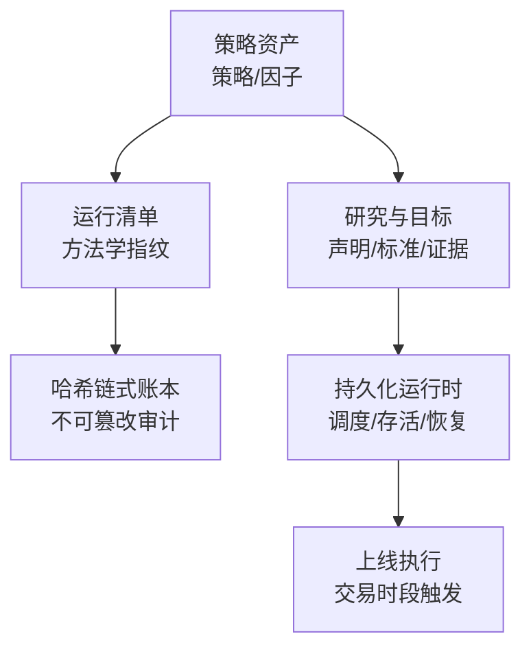
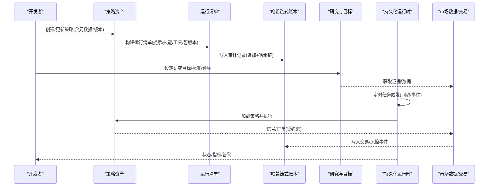
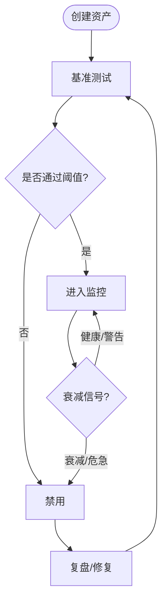
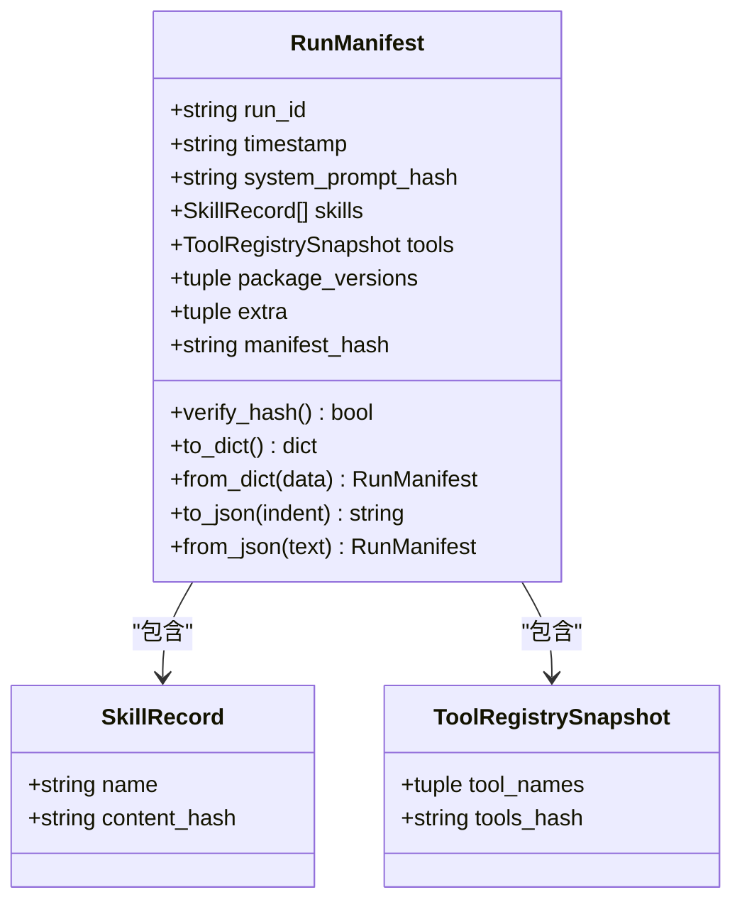
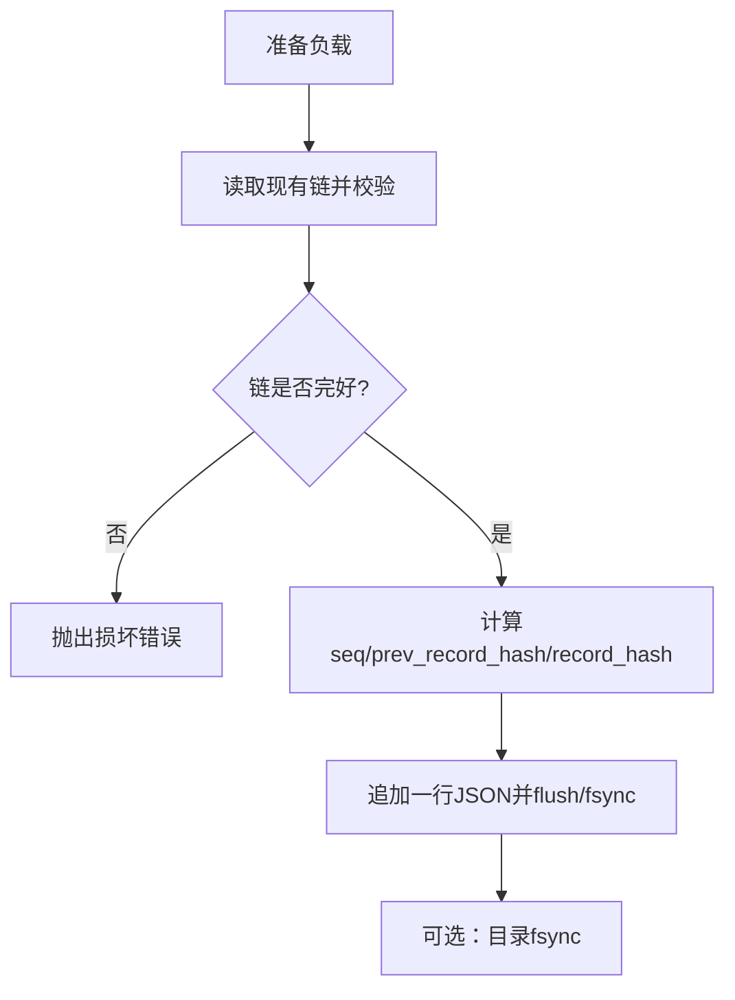
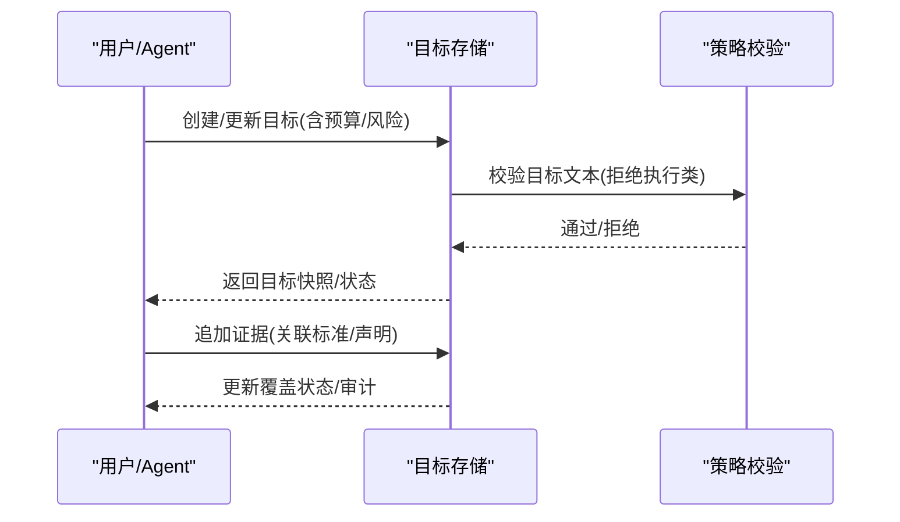
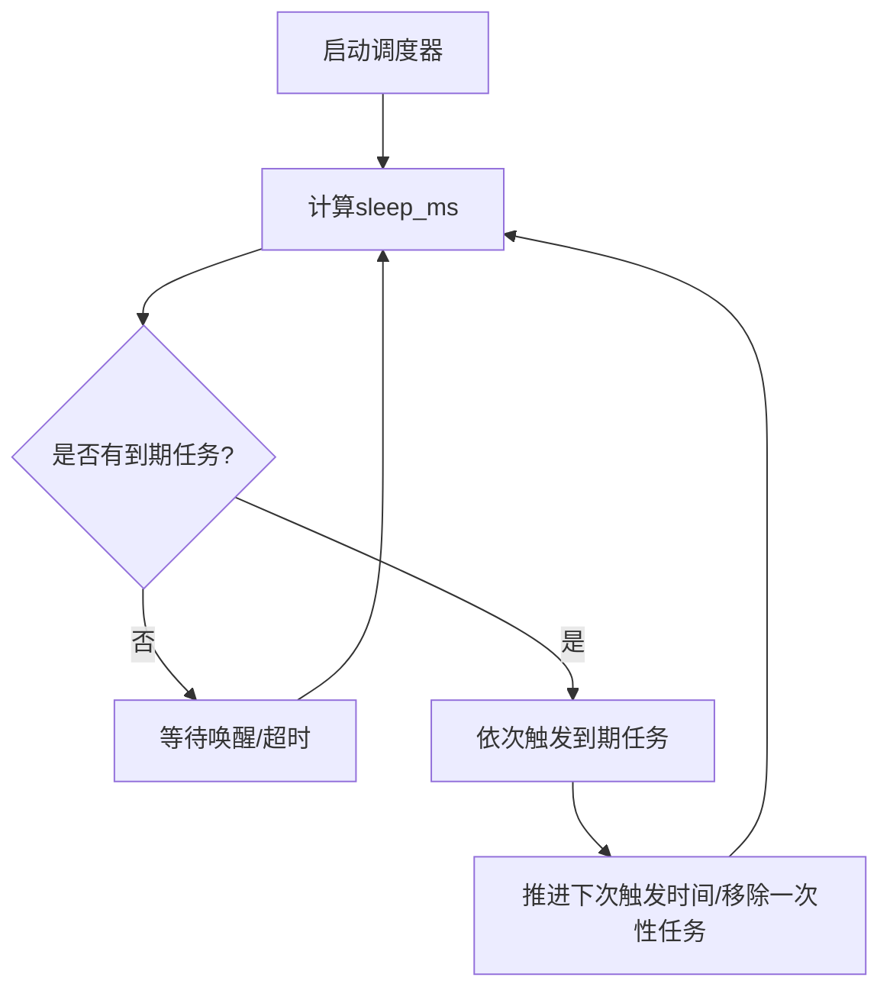
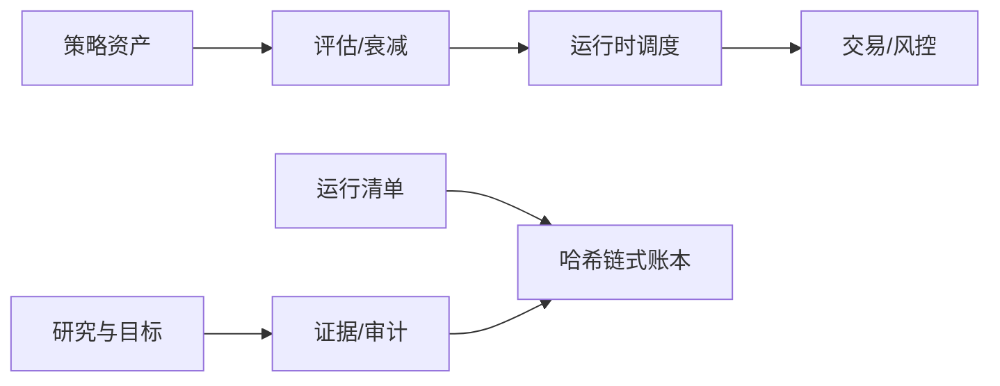

# 策略生命周期管理

<cite>
**本文引用的文件**
- [README.md](file://README.md)
- [strategy_store/models.py](file://agent/src/strategy_store/models.py)
- [strategy_store/__init__.py](file://agent/src/strategy_store/__init__.py)
- [governance/manifest.py](file://agent/src/governance/manifest.py)
- [governance/ledger.py](file://agent/src/governance/ledger.py)
- [goal/policy.py](file://agent/src/goal/policy.py)
- [goal/store.py](file://agent/src/goal/store.py)
- [live/runtime/scheduler.py](file://agent/src/live/runtime/scheduler.py)
- [live/runtime/__init__.py](file://agent/src/live/runtime/__init__.py)
</cite>

## 目录
1. [简介](#简介)
2. [项目结构](#项目结构)
3. [核心组件](#核心组件)
4. [架构总览](#架构总览)
5. [详细组件分析](#详细组件分析)
6. [依赖关系分析](#依赖关系分析)
7. [性能考量](#性能考量)
8. [故障排查指南](#故障排查指南)
9. [结论](#结论)
10. [附录](#附录)

## 简介
本文件面向“策略从开发到上线”的完整生命周期，覆盖开发环境、版本控制、测试验证、上线部署、存储与管理（元数据、依赖、配置版本化）、监控与运维（性能追踪、异常告警、自动重启）、回滚与热更新、协作共享以及治理合规检查。文档基于仓库中策略资产模型、运行清单与审计账本、目标与证据存储、以及持久化运行时调度等实现进行说明，并提供可操作的流程图与时序图帮助理解关键路径。

## 项目结构
围绕策略生命周期的关键代码集中在以下模块：
- 策略资产与衰减监控：策略/因子作为“研究产物”，具备状态机与评估指标，支持衰减信号与健康度跟踪。
- 运行方法与审计：每次运行的方法学被指纹化为“运行清单”，并可通过哈希链式账本记录不可篡改的操作日志。
- 研究与目标管理：以“研究目标”为中心，维护声明、标准、证据与审计，确保研究过程可追溯。
- 持久化运行时：提供定时任务调度、存活检测与恢复能力，支撑策略在交易时段的持续执行与重启恢复。

**图示来源**
- [strategy_store/models.py:9-132](file://agent/src/strategy_store/models.py#L9-L132)
- [governance/manifest.py:1-67](file://agent/src/governance/manifest.py#L1-L67)
- [governance/ledger.py:1-48](file://agent/src/governance/ledger.py#L1-L48)
- [goal/store.py:127-246](file://agent/src/goal/store.py#L127-L246)
- [live/runtime/scheduler.py:1-18](file://agent/src/live/runtime/scheduler.py#L1-L18)

**章节来源**
- [README.md:1-166](file://README.md#L1-L166)

## 核心组件
- 策略资产模型：定义策略/因子的类型、生命周期状态、评估结果与衰减快照，内置模型治理字段（开发者、所有者、验证者、批准者、版本、分层、用途、限制、验证状态）。
- 运行清单：对系统提示、注入技能、工具注册表、关键包版本等进行内容寻址指纹，生成可复现的方法学标识；支持清单差异对比。
- 哈希链式账本：追加式、fsync落盘、带序列号与前驱哈希的JSONL账本，支持导出与离线校验，支持分段归档与整链校验。
- 研究与目标存储：SQLite持久化的研究目标、声明、标准、证据与审计，支持预算与状态流转、证据关联与覆盖标记。
- 持久化运行时调度：异步定时器驱动的任务调度，支持间隔/一次性任务、最大重检周期、唤醒机制与失败隔离。

**章节来源**
- [strategy_store/models.py:9-178](file://agent/src/strategy_store/models.py#L9-L178)
- [governance/manifest.py:128-249](file://agent/src/governance/manifest.py#L128-L249)
- [governance/ledger.py:133-222](file://agent/src/governance/ledger.py#L133-L222)
- [goal/store.py:106-126](file://agent/src/goal/store.py#L106-L126)
- [live/runtime/scheduler.py:51-176](file://agent/src/live/runtime/scheduler.py#L51-L176)

## 架构总览
下图展示策略从开发到上线的关键流程与组件交互：策略资产在研发阶段产生评估与衰减信号；每次运行生成方法学清单并写入哈希链式账本；研究目标贯穿证据收集与合规校验；运行时调度在交易时段触发策略执行，并在异常或重启后恢复。

**图示来源**
- [strategy_store/models.py:80-178](file://agent/src/strategy_store/models.py#L80-L178)
- [governance/manifest.py:356-430](file://agent/src/governance/manifest.py#L356-L430)
- [governance/ledger.py:368-469](file://agent/src/governance/ledger.py#L368-L469)
- [goal/store.py:260-387](file://agent/src/goal/store.py#L260-L387)
- [live/runtime/scheduler.py:178-329](file://agent/src/live/runtime/scheduler.py#L178-L329)

## 详细组件分析

### 策略资产与衰减监控
- 资产类型与状态：支持因子与策略两类资产；生命周期包含创建、基准测试、活跃、监控、衰减、禁用等状态。
- 评估指标：因子侧IC均值/标准差、IR、正IC比例、t统计量；策略侧夏普、年化收益、最大回撤、卡玛比率。
- 衰减快照：滚动IC均值/IR、基线IC比值、连续警告计数、健康/警告/衰减/危急信号。
- 模型治理：开发者/所有者/验证者/批准者、模型版本/资产版本、分层、用途/限制、验证状态及状态迁移规则。

**图示来源**
- [strategy_store/models.py:9-178](file://agent/src/strategy_store/models.py#L9-L178)

**章节来源**
- [strategy_store/models.py:9-178](file://agent/src/strategy_store/models.py#L9-L178)
- [strategy_store/__init__.py:1-22](file://agent/src/strategy_store/__init__.py#L1-L22)

### 运行清单与方法学指纹
- 清单组成：系统提示哈希、注入技能名称与内容哈希、工具注册表快照（排序名+哈希）、关键包版本、额外维度（如提供商/模型）。
- 可重复性：排除run_id与timestamp参与哈希，保证相同方法学在不同时间产生相同清单哈希。
- 差异对比：精确指出系统提示变化、技能增删改、工具增减、包版本变更、额外维度变化。

**图示来源**
- [governance/manifest.py:128-249](file://agent/src/governance/manifest.py#L128-L249)

**章节来源**
- [governance/manifest.py:1-67](file://agent/src/governance/manifest.py#L1-L67)
- [governance/manifest.py:356-430](file://agent/src/governance/manifest.py#L356-L430)
- [governance/manifest.py:433-531](file://agent/src/governance/manifest.py#L433-L531)

### 哈希链式账本与审计
- 追加式记录：每条记录包含序列号、前驱记录哈希与自身哈希，形成链式不可篡改结构。
- 持久化与并发：默认fsync落盘，首次创建目录也fsync；使用平台适配的独占锁避免并发冲突。
- 完整性校验：支持整链校验、导出与离线校验；支持分段归档与跨段校验。
- 错误处理：若发现已有链条损坏，拒绝继续追加，抛出明确错误。

**图示来源**
- [governance/ledger.py:368-469](file://agent/src/governance/ledger.py#L368-L469)
- [governance/ledger.py:596-663](file://agent/src/governance/ledger.py#L596-L663)
- [governance/ledger.py:665-739](file://agent/src/governance/ledger.py#L665-L739)

**章节来源**
- [governance/ledger.py:1-48](file://agent/src/governance/ledger.py#L1-L48)
- [governance/ledger.py:133-222](file://agent/src/governance/ledger.py#L133-L222)
- [governance/ledger.py:309-324](file://agent/src/governance/ledger.py#L309-L324)
- [governance/ledger.py:496-585](file://agent/src/governance/ledger.py#L496-L585)

### 研究与目标管理（证据与合规）
- 目标与声明：每个研究目标包含目标文本、UI摘要、来源、协议、风险等级与预算；声明用于承载研究主张。
- 标准与证据：标准描述必须满足的条件；证据记录来源、方法、假设、置信度、矛盾声明等，并可标记覆盖状态。
- 预算与状态：支持token/轮次/时间预算，超限时进入受限状态；完成时需审计校验。
- 安全策略：拒绝直接交易或执行类目标文本，防止误用。

**图示来源**
- [goal/store.py:260-387](file://agent/src/goal/store.py#L260-L387)
- [goal/store.py:601-698](file://agent/src/goal/store.py#L601-L698)
- [goal/policy.py:57-69](file://agent/src/goal/policy.py#L57-L69)

**章节来源**
- [goal/store.py:127-246](file://agent/src/goal/store.py#L127-L246)
- [goal/store.py:389-452](file://agent/src/goal/store.py#L389-L452)
- [goal/store.py:700-768](file://agent/src/goal/store.py#L700-L768)
- [goal/policy.py:1-49](file://agent/src/goal/policy.py#L1-L49)

### 持久化运行时与调度
- 任务模型：支持间隔与一次性任务，携带应用负载（如指令ID/标的集合），调度器不解析负载。
- 调度循环：计算最早下次触发时间，睡眠至多固定重检周期，唤醒后可立即响应新增/删除任务。
- 失败隔离：单个任务异常仅记录日志，不影响其他任务与调度主循环。
- 存活与恢复：结合外部持久化存储（JobStore）实现任务集持久化，进程重启后恢复。

**图示来源**
- [live/runtime/scheduler.py:100-176](file://agent/src/live/runtime/scheduler.py#L100-L176)
- [live/runtime/scheduler.py:178-329](file://agent/src/live/runtime/scheduler.py#L178-L329)

**章节来源**
- [live/runtime/__init__.py:1-14](file://agent/src/live/runtime/__init__.py#L1-L14)
- [live/runtime/scheduler.py:1-18](file://agent/src/live/runtime/scheduler.py#L1-L18)
- [live/runtime/scheduler.py:51-176](file://agent/src/live/runtime/scheduler.py#L51-L176)
- [live/runtime/scheduler.py:178-329](file://agent/src/live/runtime/scheduler.py#L178-L329)

## 依赖关系分析
- 策略资产依赖评估与衰减监控，产出策略信号与指标；这些结果驱动运行时调度与交易执行。
- 运行清单依赖系统提示、技能、工具注册表与包版本，为每次运行提供可复现的方法学指纹。
- 哈希链式账本依赖文件系统与平台锁，为所有关键操作提供不可篡改审计。
- 研究与目标存储依赖SQLite与线程锁，保障并发安全与事务一致性。
- 运行时调度依赖事件循环与可注入时钟源，便于测试与确定性行为。

**图示来源**
- [strategy_store/models.py:80-178](file://agent/src/strategy_store/models.py#L80-L178)
- [governance/manifest.py:356-430](file://agent/src/governance/manifest.py#L356-L430)
- [governance/ledger.py:368-469](file://agent/src/governance/ledger.py#L368-L469)
- [goal/store.py:260-387](file://agent/src/goal/store.py#L260-L387)
- [live/runtime/scheduler.py:178-329](file://agent/src/live/runtime/scheduler.py#L178-L329)

**章节来源**
- [strategy_store/models.py:80-178](file://agent/src/strategy_store/models.py#L80-L178)
- [governance/manifest.py:356-430](file://agent/src/governance/manifest.py#L356-L430)
- [governance/ledger.py:368-469](file://agent/src/governance/ledger.py#L368-L469)
- [goal/store.py:260-387](file://agent/src/goal/store.py#L260-L387)
- [live/runtime/scheduler.py:178-329](file://agent/src/live/runtime/scheduler.py#L178-L329)

## 性能考量
- 清单与账本：清单构建为纯函数且无时钟读取，适合高频调用；账本追加为O(n)全链校验，适用于低频高价值事件（订单/风控/中止）。
- 运行时调度：最大重检周期限制避免长睡错过事件；任务异常隔离提升整体可用性。
- 研究与目标存储：WAL模式与事务优化提高并发写性能；索引加速查询。
- 建议：在高吞吐场景下，将清单与账本写入分离，批量导出与离线校验降低在线开销。

[本节为通用指导，无需具体文件引用]

## 故障排查指南
- 账本损坏：当追加时发现链条已损坏，会抛出明确错误；需先校验并定位首个断点，必要时归档并重建活动文件。
- 清单不一致：通过清单差异对比快速识别系统提示、技能、工具、包版本的变化，辅助回归定位。
- 目标状态异常：检查预算是否超限、证据是否覆盖标准、审计是否完整；确认目标未被替换或过期。
- 调度异常：查看任务列表与最近触发时间，确认是否存在长时间未唤醒或任务异常阻塞；必要时重置任务或调整重检周期。

**章节来源**
- [governance/ledger.py:208-222](file://agent/src/governance/ledger.py#L208-L222)
- [governance/manifest.py:433-531](file://agent/src/governance/manifest.py#L433-L531)
- [goal/store.py:700-768](file://agent/src/goal/store.py#L700-L768)
- [live/runtime/scheduler.py:313-329](file://agent/src/live/runtime/scheduler.py#L313-L329)

## 结论
本方案通过“策略资产—运行清单—哈希链式账本—研究与目标—持久化运行时”的闭环，实现了策略从开发到上线的全生命周期管理。清单确保方法学可复现，账本提供不可篡改审计，目标与证据保障研究严谨性，运行时调度支撑稳定执行与恢复。配合衰减监控与治理字段，可在规模化团队中实现策略的版本化、协作化与合规化。

[本节为总结，无需具体文件引用]

## 附录

### 开发与部署最佳实践
- 开发环境：使用清单记录系统提示、技能与工具组合，确保本地与CI一致；关键包版本纳入清单。
- 版本控制：策略资产与清单均纳入版本管理；每次运行生成清单并附于提交或制品。
- 测试验证：利用衰减监控与基准指标进行回归；对清单差异进行自动化比对。
- 上线部署：通过运行时调度在交易时段触发；启用账本审计与导出，便于事后核查。

[本节为通用指导，无需具体文件引用]

### 监控与运维
- 性能追踪：记录策略指标与衰减信号；在清单中保留包版本以便复现实验。
- 异常告警：对账本损坏、目标状态异常、调度失败进行告警；定期校验账本完整性。
- 自动重启：运行时结合持久化存储实现任务恢复；清单与账本确保重启后上下文一致。

**章节来源**
- [governance/ledger.py:596-663](file://agent/src/governance/ledger.py#L596-L663)
- [live/runtime/scheduler.py:178-329](file://agent/src/live/runtime/scheduler.py#L178-L329)

### 回滚与热更新
- 回滚：通过清单哈希快速定位到历史方法学版本；结合策略资产版本与评估结果进行回滚决策。
- 热更新：在不中断运行的情况下切换策略资产版本；通过运行时调度动态加载新策略，旧策略优雅退出。

[本节为通用指导，无需具体文件引用]

### 协作与共享
- 共享策略资产：附带治理字段（开发者/所有者/验证者/批准者/版本/用途/限制），便于团队协作与责任划分。
- 共享清单与账本：导出清单与账本供他人复现与审计；使用差异对比工具审查变更。

**章节来源**
- [strategy_store/models.py:80-178](file://agent/src/strategy_store/models.py#L80-L178)
- [governance/manifest.py:433-531](file://agent/src/governance/manifest.py#L433-L531)
- [governance/ledger.py:496-585](file://agent/src/governance/ledger.py#L496-L585)

### 治理与合规检查
- 四眼原则：检测开发者与批准者为同一人的情况，提示政策风险。
- 验证状态迁移：禁止从未验证直接批准，确保独立验证流程。
- 用途与限制：强制填写策略用途与已知限制，增强透明度。

**章节来源**
- [strategy_store/models.py:191-258](file://agent/src/strategy_store/models.py#L191-L258)