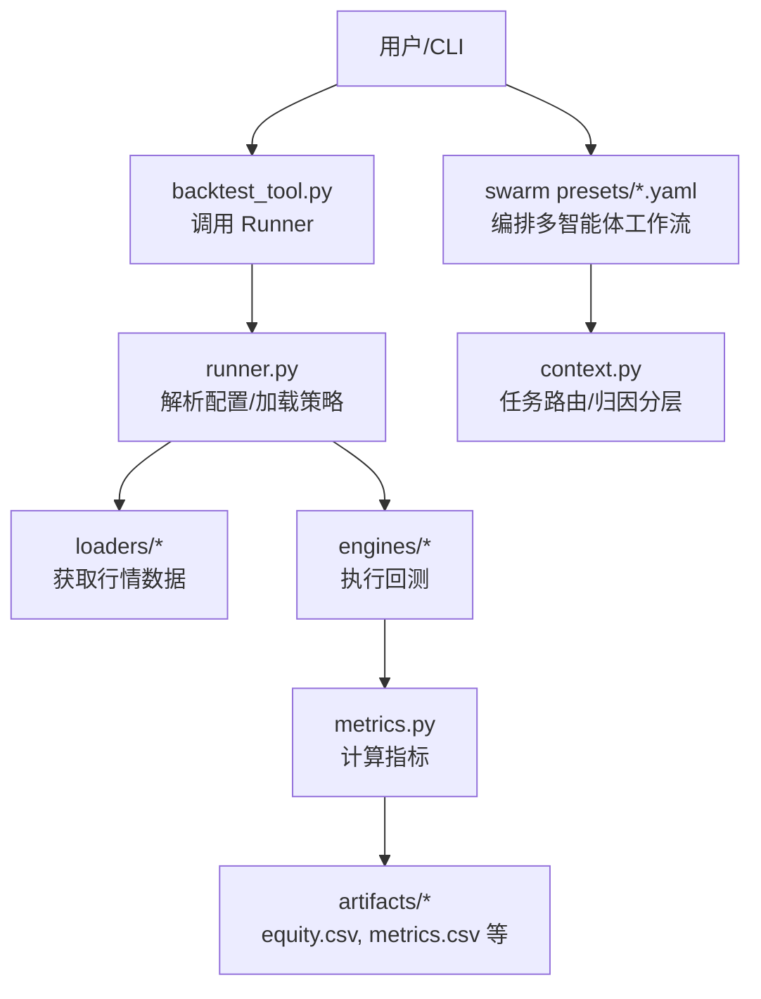
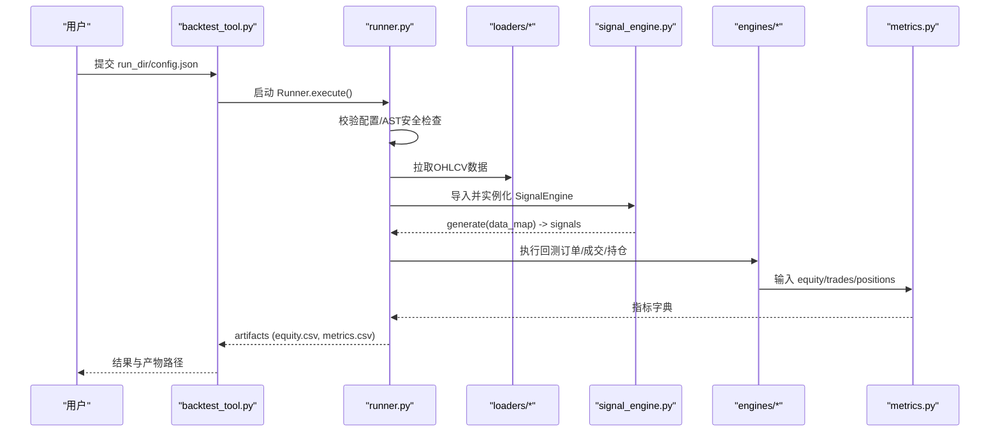
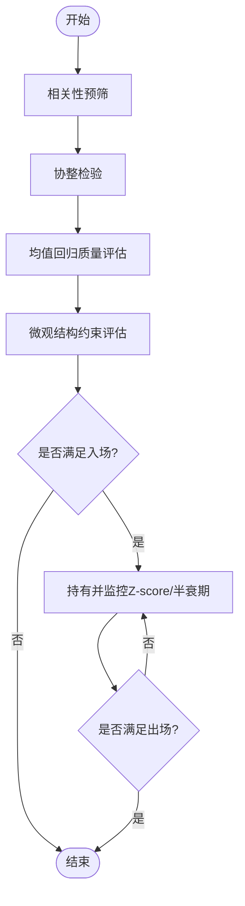
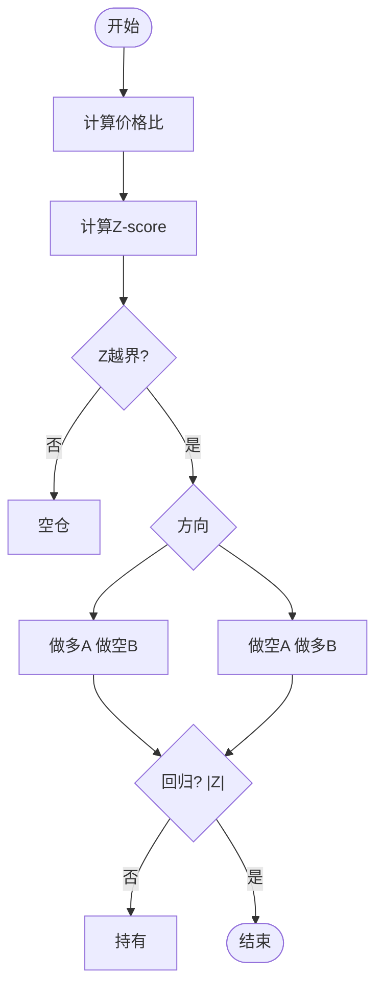
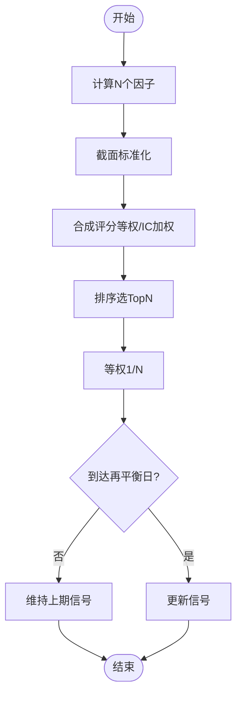
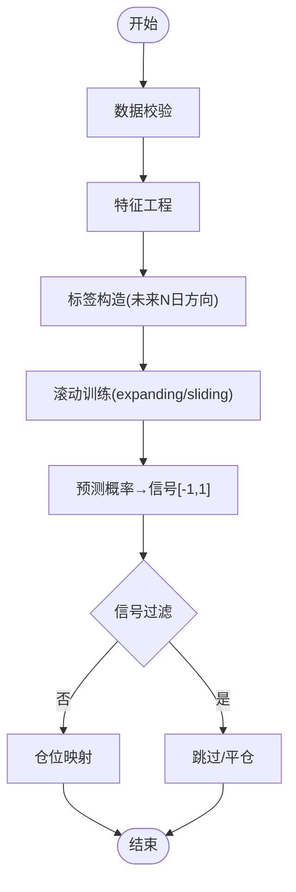
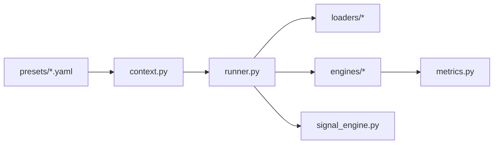

# 策略类型与实现

<cite>
**本文引用的文件**
- [README.md](file://README.md)
- [runner.py](file://agent/backtest/runner.py)
- [metrics.py](file://agent/backtest/metrics.py)
- [SKILL.md（配对交易）](file://agent/src/skills/pair-trading/SKILL.md)
- [SKILL.md（多因子）](file://agent/src/skills/multi-factor/SKILL.md)
- [SKILL.md（机器学习策略）](file://agent/src/skills/ml-strategy/SKILL.md)
- [statistical_arbitrage_desk.yaml](file://agent/src/swarm/presets/statistical_arbitrage_desk.yaml)
- [factor_research_committee.yaml](file://agent/src/swarm/presets/factor_research_committee.yaml)
- [quant_strategy_desk.yaml](file://agent/src/swarm/presets/quant_strategy_desk.yaml)
- [context.py](file://agent/src/agent/context.py)
- [backtest_tool.py](file://agent/src/tools/backtest_tool.py)
- [autopilot_tool.py](file://agent/src/tools/autopilot_tool.py)
</cite>

## 目录
1. [引言](#引言)
2. [项目结构](#项目结构)
3. [核心组件](#核心组件)
4. [架构总览](#架构总览)
5. [详细组件分析](#详细组件分析)
6. [依赖关系分析](#依赖关系分析)
7. [性能考量](#性能考量)
8. [故障排查指南](#故障排查指南)
9. [结论](#结论)
10. [附录](#附录)

## 引言
本文件面向高级策略类型的系统化文档，覆盖统计套利、配对交易、多因子策略、机器学习策略等复杂策略的理论基础与工程实现。重点说明：
- 信号生成逻辑、入场出场条件、仓位管理规则
- 基于项目框架的策略开发流程（配置、代码、回测、评估）
- 参数调优、回测验证、实盘适配方法
- 策略绩效评估指标与风险控制措施

本项目提供统一的回测执行入口、安全沙箱化的策略代码加载、标准化的指标计算与报告输出，以及多种“工作流预设”（Swarm Presets）来驱动从研究到回测的自动化流水线。

**章节来源**
- [README.md:1052-1097](file://README.md#L1052-L1097)

## 项目结构
围绕策略开发与回测的关键目录与职责：
- backtest/runner.py：统一回测入口，负责读取配置、选择数据源、导入并校验策略代码、运行引擎、收集产物
- backtest/metrics.py：年化、收益、回撤、换手率、基准对比等指标计算
- skills/*：策略技能与模板（如配对交易、多因子、机器学习策略），定义信号约定、参数、示例配置
- swarm/presets/*.yaml：工作流预设，编排多个智能体完成“扫描→设计→回测→风控评审”的闭环
- agent/src/agent/context.py：任务路由与分层归因分析指引
- tools/backtest_tool.py、tools/autopilot_tool.py：封装回测执行与自动脚手架工具

**图表来源**
- [runner.py:1-80](file://agent/backtest/runner.py#L1-L80)
- [metrics.py:16-170](file://agent/backtest/metrics.py#L16-L170)
- [backtest_tool.py:42-78](file://agent/src/tools/backtest_tool.py#L42-L78)
- [statistical_arbitrage_desk.yaml:1-168](file://agent/src/swarm/presets/statistical_arbitrage_desk.yaml#L1-L168)
- [context.py:73-105](file://agent/src/agent/context.py#L73-L105)

**章节来源**
- [runner.py:1-80](file://agent/backtest/runner.py#L1-L80)
- [metrics.py:16-170](file://agent/backtest/metrics.py#L16-L170)
- [backtest_tool.py:42-78](file://agent/src/tools/backtest_tool.py#L42-L78)
- [statistical_arbitrage_desk.yaml:1-168](file://agent/src/swarm/presets/statistical_arbitrage_desk.yaml#L1-L168)
- [context.py:73-105](file://agent/src/agent/context.py#L73-L105)

## 核心组件
- 回测执行器（Runner）
  - 读取 config.json，校验字段（日期、区间、资金、引擎、数据源）
  - 通过 AST 静态检查与运行时可达路径扫描，阻止危险操作（网络、进程、文件系统写入、动态执行等）
  - 动态导入 signal_engine.py 中的 SignalEngine，并调用 generate(data_map) 得到信号
- 指标计算（Metrics）
  - 年化因子映射（按数据源与周期）
  - 收益序列构造（bar_returns）、买入持有回报（buy_and_hold_return）
  - 组合指标：总收益、年化收益、最大回撤、夏普、索提诺、卡玛、胜率、盈亏比、换手率、跟踪误差、信息比率、基准Beta
- 策略技能（Skills）
  - 配对交易：价差/Z-score 均值回归，双标的多空对冲
  - 多因子：截面标准化、合成评分、TopN 等权构建组合
  - 机器学习：特征工程、标签构造、滚动训练与预测、信号裁剪
- 工作流预设（Presets）
  - 统计套利桌面：配对扫描→微观结构分析→策略设计→回测→风控评审
  - 多因子研究委员会：因子挖掘→相关性/权重优化→选股规则→回测诊断
  - 量化策略桌面：技术/基本面→策略代码→回测→风险审计

**章节来源**
- [runner.py:68-163](file://agent/backtest/runner.py#L68-L163)
- [runner.py:324-817](file://agent/backtest/runner.py#L324-L817)
- [metrics.py:178-641](file://agent/backtest/metrics.py#L178-L641)
- [SKILL.md（配对交易）:1-81](file://agent/src/skills/pair-trading/SKILL.md#L1-L81)
- [SKILL.md（多因子）:1-79](file://agent/src/skills/multi-factor/SKILL.md#L1-L79)
- [SKILL.md（机器学习策略）:1-267](file://agent/src/skills/ml-strategy/SKILL.md#L1-L267)
- [statistical_arbitrage_desk.yaml:1-168](file://agent/src/swarm/presets/statistical_arbitrage_desk.yaml#L1-L168)
- [factor_research_committee.yaml:134-206](file://agent/src/swarm/presets/factor_research_committee.yaml#L134-L206)
- [quant_strategy_desk.yaml:61-92](file://agent/src/swarm/presets/quant_strategy_desk.yaml#L61-L92)

## 架构总览
下图展示从用户触发到策略产出指标的端到端流程，包括安全沙箱、数据加载、信号生成、回测执行与指标计算。

**图表来源**
- [backtest_tool.py:42-78](file://agent/src/tools/backtest_tool.py#L42-L78)
- [runner.py:1-80](file://agent/backtest/runner.py#L1-L80)
- [metrics.py:461-626](file://agent/backtest/metrics.py#L461-L626)

## 详细组件分析

### 统计套利（Statistical Arbitrage）
- 理论基础
  - 协整检验（Engle–Granger/Johansen）筛选长期均衡关系
  - 均值回归：价差或价比的Z-score偏离后回归均值
  - 动态对冲比率：Kalman滤波滚动估计beta，控制漂移
- 信号生成逻辑
  - 阶段1：相关性预筛（滚动相关系数阈值）
  - 阶段2：协整检验（p值阈值）
  - 阶段3：均值回归质量（半衰期估计、稳定性）
  - 阶段4：微观结构约束（流动性、滑点、冲击成本）
- 入场/出场条件
  - 入场：|Z|超过阈值（可随波动率动态调整），排除财报窗口与单边趋势
  - 出场：价差回归至±0.5σ内；止损|Z|超阈；时间止损（超过2倍半衰期未回归）；协整失效强制平仓
- 仓位管理
  - 多对组合（建议5–15对），等风险贡献（反波动加权）
  - 组合内相关性控制，避免集中暴露
- 回测与评估
  - 使用工作流预设“统计套利桌面”驱动扫描→设计→回测→风控评审
  - 指标参考：年化超额、信息比率、最大回撤、换手率、尾部风险

**图表来源**
- [statistical_arbitrage_desk.yaml:1-168](file://agent/src/swarm/presets/statistical_arbitrage_desk.yaml#L1-L168)

**章节来源**
- [statistical_arbitrage_desk.yaml:1-168](file://agent/src/swarm/presets/statistical_arbitrage_desk.yaml#L1-L168)

### 配对交易（Pair Trading）
- 理论基础
  - 两资产高相关性，价格比或价差偏离均值后回归
- 信号生成逻辑
  - ratio = close_A / close_B
  - rolling mean/std → Z-score
  - |Z| > entry_z 开仓；|Z| < exit_z 平仓
- 入场/出场条件
  - 入场：Z低于负阈值做多A做空B；Z高于正阈值做空A做多B
  - 出场：Z回归至接近均值
- 仓位管理
  - 等权分配（各50%），严格方向相反
- 回测与评估
  - 使用“配对交易”技能模板，注意数据对齐与lookback填充
  - 指标关注：胜率、盈亏比、最大回撤、换手率

**图表来源**
- [SKILL.md（配对交易）:12-35](file://agent/src/skills/pair-trading/SKILL.md#L12-L35)

**章节来源**
- [SKILL.md（配对交易）:12-35](file://agent/src/skills/pair-trading/SKILL.md#L12-L35)

### 多因子策略（Multi-Factor）
- 理论基础
  - 截面标准化（Z-score）消除量纲差异
  - 因子合成（等权或IC加权）
  - TopN 选股，等权构建组合
- 信号生成逻辑
  - 计算多因子（动量、反转、波动率、成交量比率等）
  - 截面标准化，合成评分
  - 排序选TopN，权重=1/N
- 入场/出场条件
  - 再平衡频率控制（例如每20个交易日）
  - 因子方向对齐后再标准化
- 仓位管理
  - 等权TopN，保持中性与分散
- 回测与评估
  - 使用“多因子研究委员会”预设进行因子挖掘、相关性矩阵、权重优化与回测诊断
  - 指标关注：信息比率、跟踪误差、换手率、行业/风格中性

**图表来源**
- [SKILL.md（多因子）:12-47](file://agent/src/skills/multi-factor/SKILL.md#L12-L47)
- [factor_research_committee.yaml:134-206](file://agent/src/swarm/presets/factor_research_committee.yaml#L134-L206)

**章节来源**
- [SKILL.md（多因子）:12-47](file://agent/src/skills/multi-factor/SKILL.md#L12-L47)
- [factor_research_committee.yaml:134-206](file://agent/src/swarm/presets/factor_research_committee.yaml#L134-L206)

### 机器学习策略（Machine Learning）
- 理论基础
  - 特征工程（动量、波动率、RSI、均线偏离、成交量比率、日内特征等）
  - 标签构造（未来N日收益率方向）
  - 滚动训练（expanding/sliding window），避免前视偏差
- 信号生成逻辑
  - 数据校验（列、行数、缺失率）
  - 特征构建与清洗（inf→NaN，除零保护）
  - 模型训练（随机森林/梯度提升/岭回归）
  - 预测映射为[-1,1]连续强度信号或离散{-1,0,1}
- 入场/出场条件
  - 以信号强度或阈值过滤（如abs(signal)<threshold设为0）
  - 结合波动率/流动性过滤降低假信号
- 仓位管理
  - 信号强度→仓位比例（可线性映射或分段映射）
  - 组合层面做风险预算与相关性控制
- 回测与评估
  - 使用“机器学习策略”技能模板，确保walk-forward无泄漏
  - 指标关注：夏普、最大回撤、胜率、盈亏比、换手率

**图表来源**
- [SKILL.md（机器学习策略）:12-267](file://agent/src/skills/ml-strategy/SKILL.md#L12-L267)

**章节来源**
- [SKILL.md（机器学习策略）:12-267](file://agent/src/skills/ml-strategy/SKILL.md#L12-L267)

## 依赖关系分析
- runner.py 依赖 loaders 注册表与 _market_hooks 进行市场识别与数据路由
- metrics.py 提供跨数据源的年化与指标计算，被回测引擎与报告模块复用
- skills 提供策略模板与信号约定，供自动生成或手工编写 signal_engine.py
- swarm presets 编排多智能体协作，将研究、设计、回测、风控串联
- context.py 提供任务路由与分层归因分析指引，指导回测后的诊断流程

**图表来源**
- [runner.py:30-47](file://agent/backtest/runner.py#L30-L47)
- [metrics.py:16-170](file://agent/backtest/metrics.py#L16-L170)
- [statistical_arbitrage_desk.yaml:1-168](file://agent/src/swarm/presets/statistical_arbitrage_desk.yaml#L1-L168)
- [context.py:73-105](file://agent/src/agent/context.py#L73-L105)

**章节来源**
- [runner.py:30-47](file://agent/backtest/runner.py#L30-L47)
- [metrics.py:16-170](file://agent/backtest/metrics.py#L16-L170)
- [statistical_arbitrage_desk.yaml:1-168](file://agent/src/swarm/presets/statistical_arbitrage_desk.yaml#L1-L168)
- [context.py:73-105](file://agent/src/agent/context.py#L73-L105)

## 性能考量
- 年化与换手率
  - 不同数据源与周期的年化因子映射影响Sharpe/Sortino等指标
  - 换手率可从权重变化或实际成交证据计算，影响交易成本与净收益
- 收益序列构造
  - bar_returns 对非正/无穷前价进行保护，避免极端百分比收益导致指标失真
- 小样本与有限值
  - 单观测返回标准差为0时，夏普/索提诺退化为0，避免NaN传播
- 基准对比
  - 跟踪误差与信息比率需对齐基准序列，处理缺失与异常值

[本节为通用性能讨论，不直接分析具体文件]

## 故障排查指南
- 策略代码安全与语法
  - runner.py 在导入前进行AST检查，禁止装饰器、类级可执行语句、危险模块/属性/内置函数
  - 运行时可达路径扫描拒绝网络、进程、文件系统写入、动态执行等
- 配置校验
  - codes非空、日期格式正确、区间与引擎合法、初始资金为正且有限
- 数据与对齐
  - 配对交易要求两标的索引对齐（内连接），lookback填充前Z-score为NaN需填0
- 回测产物
  - 若artifacts缺失或equity含NaN，需检查数据源、信号逻辑与回测引擎
- 归因与诊断
  - 使用context.py的分层归因（交易归因、Beta回归、极端情景、过拟合检测）定位问题

**章节来源**
- [runner.py:324-817](file://agent/backtest/runner.py#L324-L817)
- [runner.py:68-163](file://agent/backtest/runner.py#L68-L163)
- [SKILL.md（配对交易）:64-81](file://agent/src/skills/pair-trading/SKILL.md#L64-L81)
- [context.py:73-105](file://agent/src/agent/context.py#L73-L105)

## 结论
本项目提供了从策略思想到回测落地的完整工程链：
- 通过skills明确策略信号约定与参数，便于快速原型与迭代
- 通过runner的安全沙箱与配置校验，保障回测过程稳定可靠
- 通过metrics的统一指标体系，支持横向比较与稳健性评估
- 通过presets的多智能体工作流，实现从研究到风控的闭环
建议在实盘前完成：参数敏感性测试、IS/OOS拆分、交易成本与流动性压力测试、尾部风险与极端情景分析，并结合context的分层归因持续优化。

[本节为总结性内容，不直接分析具体文件]

## 附录
- 策略开发步骤（基于项目框架）
  - 编写config.json（source、codes、start_date、end_date、initial_cash、commission等）
  - 编写code/signal_engine.py（SignalEngine.generate(data_map) -> dict[str, pd.Series]）
  - 调用backtest(run_dir=...)执行回测，读取artifacts/metrics.csv与equity.csv
  - 使用workflows presets驱动自动化研究与回测
- 常用命令与示例
  - 多因子信号组合：from src.skills.multi_factor.zoo_signal_engine import ZooSignalEngine
  - Swarm工作流：vibe-trading --swarm-run quant_strategy_desk / statistical_arbitrage_desk / factor_research_committee
- 关键指标参考
  - Sharpe、Sortino、Calmar、MaxDD、Win Rate、Profit Factor、Information Ratio、Tracking Error、Benchmark Beta

**章节来源**
- [README.md:1052-1097](file://README.md#L1052-L1097)
- [SKILL.md（多因子）:59-79](file://agent/src/skills/multi-factor/SKILL.md#L59-L79)
- [statistical_arbitrage_desk.yaml:1-168](file://agent/src/swarm/presets/statistical_arbitrage_desk.yaml#L1-L168)
- [factor_research_committee.yaml:134-206](file://agent/src/swarm/presets/factor_research_committee.yaml#L134-L206)
- [quant_strategy_desk.yaml:61-92](file://agent/src/swarm/presets/quant_strategy_desk.yaml#L61-L92)