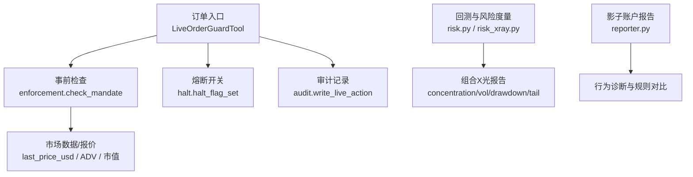
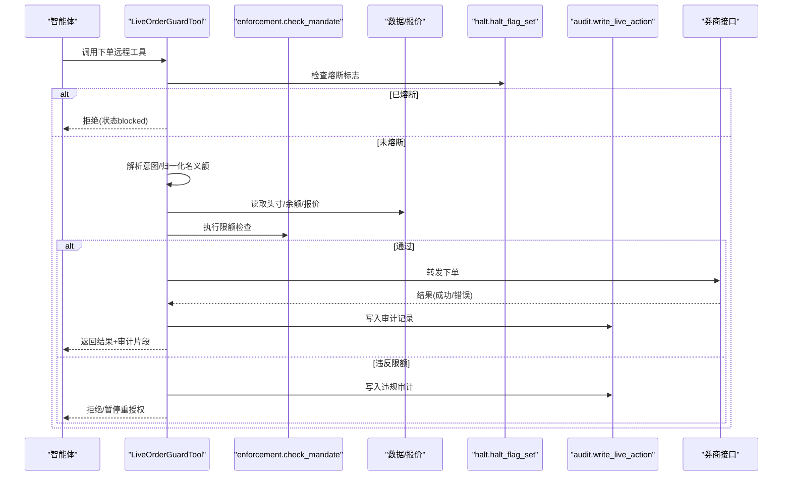
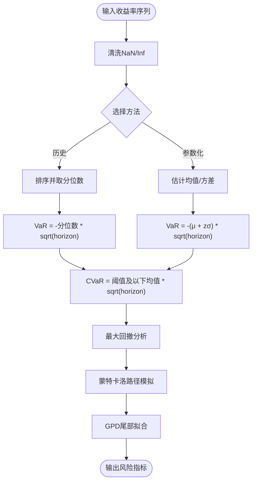
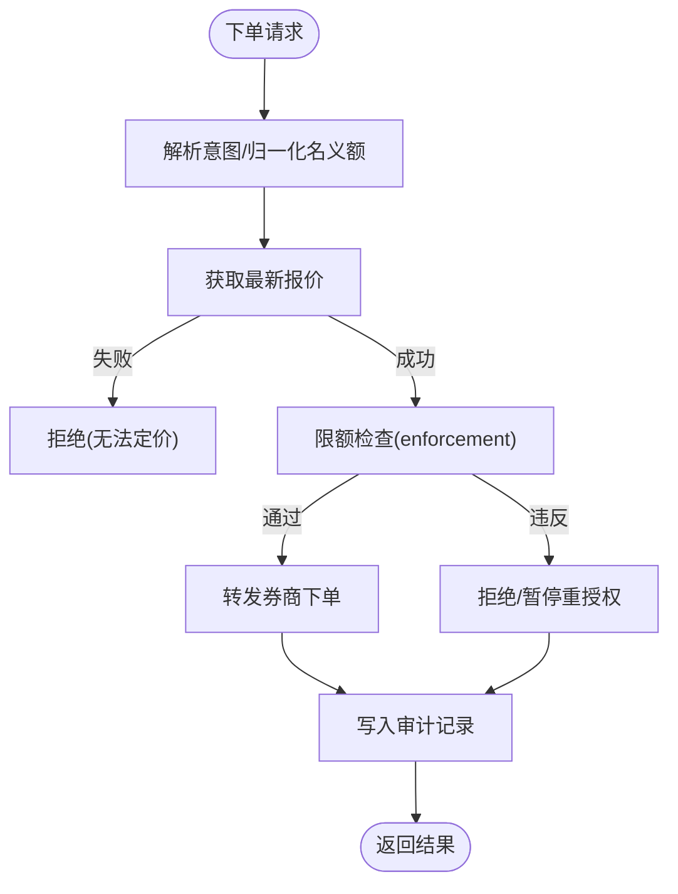
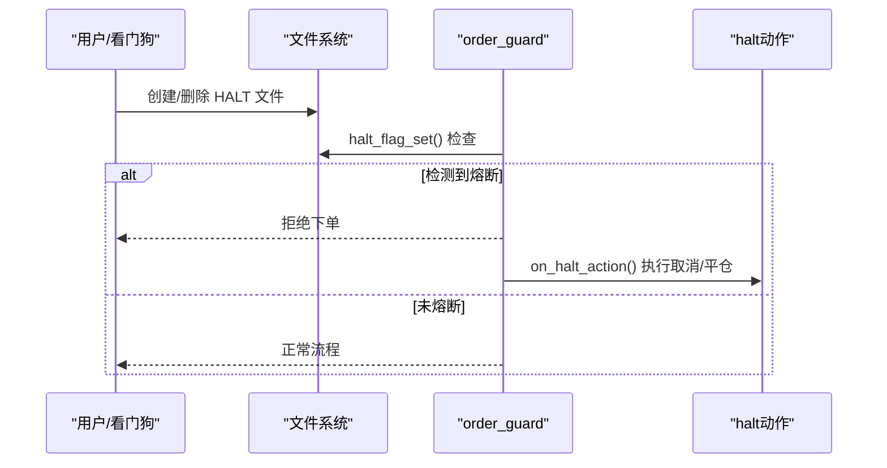
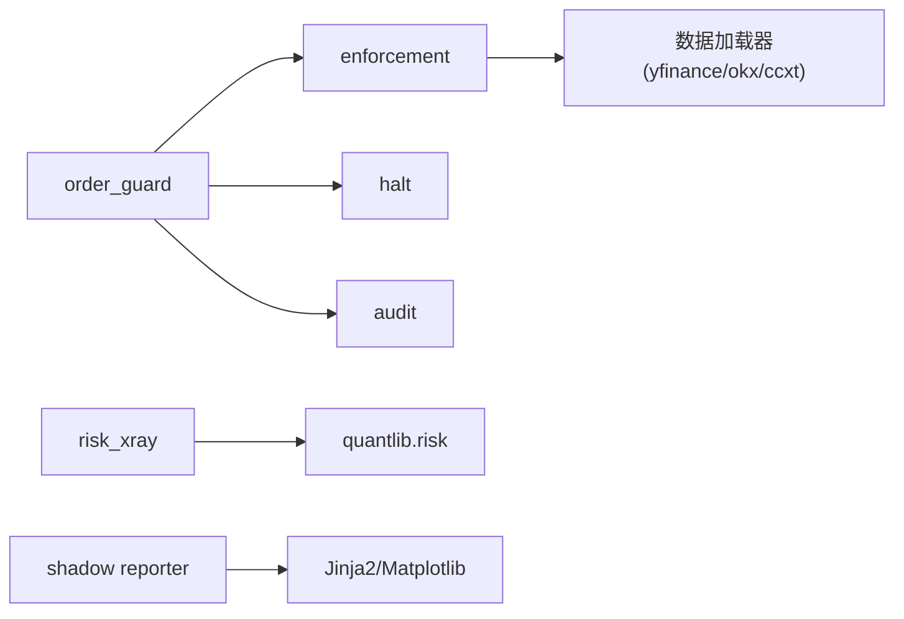

# 风险控制体系

<cite>
**本文引用的文件**
- [agent/src/quantlib/risk.py](file://agent/src/quantlib/risk.py)
- [agent/backtest/risk_xray.py](file://agent/backtest/risk_xray.py)
- [agent/src/live/order_guard.py](file://agent/src/live/order_guard.py)
- [agent/src/live/enforcement.py](file://agent/src/live/enforcement.py)
- [agent/src/live/halt.py](file://agent/src/live/halt.py)
- [agent/src/live/audit.py](file://agent/src/live/audit.py)
- [agent/src/shadow_account/reporter.py](file://agent/src/shadow_account/reporter.py)
- [agent/backtest/engines/base.py](file://agent/backtest/engines/base.py)
- [agent/tests/test_crypto_engine.py](file://agent/tests/test_crypto_engine.py)
- [agent/cli/main.py](file://agent/cli/main.py)
</cite>

## 目录
1. [简介](#简介)
2. [项目结构](#项目结构)
3. [核心组件](#核心组件)
4. [架构总览](#架构总览)
5. [详细组件分析](#详细组件分析)
6. [依赖关系分析](#依赖关系分析)
7. [性能考量](#性能考量)
8. [故障排查指南](#故障排查指南)
9. [结论](#结论)
10. [附录](#附录)

## 简介
本文件系统化梳理 Vibe-Trading 的风险控制体系，覆盖事前预防、事中监控与事后审计三大阶段；定义风险度量指标（VaR、CVaR、最大回撤、波动率等）；文档化实时风控规则引擎（止损止盈、仓位限制、杠杆控制）；说明压力测试与情景分析方法；提供异常检测与自动熔断机制的实现路径；并展示影子账户在风险控制中的作用。

## 项目结构
围绕风控的关键模块分布在以下位置：
- 风险度量与回测：risk.py、risk_xray.py、backtest engines
- 实时风控与指令门控：order_guard.py、enforcement.py
- 熔断与合规审计：halt.py、audit.py
- 行为复盘与策略提取：shadow_account/reporter.py

**图表来源**
- [agent/src/live/order_guard.py:130-214](file://agent/src/live/order_guard.py#L130-L214)
- [agent/src/live/enforcement.py:458-620](file://agent/src/live/enforcement.py#L458-L620)
- [agent/src/live/halt.py:135-163](file://agent/src/live/halt.py#L135-L163)
- [agent/src/live/audit.py:248-351](file://agent/src/live/audit.py#L248-L351)
- [agent/backtest/risk_xray.py:86-176](file://agent/backtest/risk_xray.py#L86-L176)
- [agent/src/quantlib/risk.py:146-251](file://agent/src/quantlib/risk.py#L146-L251)
- [agent/src/shadow_account/reporter.py:56-102](file://agent/src/shadow_account/reporter.py#L56-L102)

**章节来源**
- [agent/src/live/order_guard.py:130-214](file://agent/src/live/order_guard.py#L130-L214)
- [agent/src/live/enforcement.py:458-620](file://agent/src/live/enforcement.py#L458-L620)
- [agent/src/live/halt.py:135-163](file://agent/src/live/halt.py#L135-L163)
- [agent/src/live/audit.py:248-351](file://agent/src/live/audit.py#L248-L351)
- [agent/backtest/risk_xray.py:86-176](file://agent/backtest/risk_xray.py#L86-L176)
- [agent/src/quantlib/risk.py:146-251](file://agent/src/quantlib/risk.py#L146-L251)
- [agent/src/shadow_account/reporter.py:56-102](file://agent/src/shadow_account/reporter.py#L56-L102)

## 核心组件
- 风险度量库：实现历史/参数化 VaR、CVaR、最大回撤、蒙特卡洛模拟与极值分布拟合，统一“损失为正”的符号约定，确保 CVaR ≥ VaR 的结构性质。
- 组合风险X光：基于收盘价面板计算集中度、波动率、回撤、尾部风险、分散化与相关性，输出严格JSON安全的结果。
- 实时风控门控：对每笔下单执行事前校验（指令解析、头寸/余额快照、限额检查、报价归一化），失败即拒绝或暂停重授权。
- 强制约束与限额：涵盖排除名单、允许工具/资产类别、单笔名义额、总敞口、杠杆、日交易次数、资金上限、流动性/市值门槛等。
- 熔断系统：文件系统级全局/按经纪商熔断标志，支持预emptive动作钩子（取消挂单、平仓）。
- 审计追踪：不可变追加式审计账本，含脱敏、时间戳、可链式防篡改副本，贯穿下单、拒绝、熔断触发/清除等事件。
- 影子账户：从真实交易日志提取行为模式，生成规则化影子策略并回测，输出HTML/PDF报告用于行为诊断与策略改进。

**章节来源**
- [agent/src/quantlib/risk.py:1-55](file://agent/src/quantlib/risk.py#L1-L55)
- [agent/backtest/risk_xray.py:86-176](file://agent/backtest/risk_xray.py#L86-L176)
- [agent/src/live/order_guard.py:130-214](file://agent/src/live/order_guard.py#L130-L214)
- [agent/src/live/enforcement.py:458-620](file://agent/src/live/enforcement.py#L458-L620)
- [agent/src/live/halt.py:72-163](file://agent/src/live/halt.py#L72-L163)
- [agent/src/live/audit.py:248-351](file://agent/src/live/audit.py#L248-L351)
- [agent/src/shadow_account/reporter.py:56-102](file://agent/src/shadow_account/reporter.py#L56-L102)

## 架构总览
下图展示了从下单到风控、审计与回测的全链路交互。

**图表来源**
- [agent/src/live/order_guard.py:130-214](file://agent/src/live/order_guard.py#L130-L214)
- [agent/src/live/enforcement.py:458-620](file://agent/src/live/enforcement.py#L458-L620)
- [agent/src/live/halt.py:135-163](file://agent/src/live/halt.py#L135-L163)
- [agent/src/live/audit.py:248-351](file://agent/src/live/audit.py#L248-L351)

## 详细组件分析

### 风险度量与压力测试
- VaR/CVaR：历史与参数化方法，支持持有期缩放；保证 CVaR ≥ VaR；统一“损失为正”的符号约定。
- 最大回撤：定位峰值-谷值及恢复日期，输出正数形式的回撤幅度。
- 蒙特卡洛与极值理论：几何布朗运动路径模拟，终端分布统计；GPD拟合尾部类型（厚尾/有界/指数）。
- 组合X光：集中度(HHI/effective N)、波动率(年化/下行偏差)、回撤、尾部风险(VaR/ES)、分散化比率、相关性与Beta。

**图表来源**
- [agent/src/quantlib/risk.py:146-251](file://agent/src/quantlib/risk.py#L146-L251)
- [agent/src/quantlib/risk.py:441-517](file://agent/src/quantlib/risk.py#L441-L517)
- [agent/src/quantlib/risk.py:520-618](file://agent/src/quantlib/risk.py#L520-L618)
- [agent/src/quantlib/risk.py:621-702](file://agent/src/quantlib/risk.py#L621-L702)
- [agent/backtest/risk_xray.py:86-176](file://agent/backtest/risk_xray.py#L86-L176)

**章节来源**
- [agent/src/quantlib/risk.py:146-251](file://agent/src/quantlib/risk.py#L146-L251)
- [agent/src/quantlib/risk.py:441-517](file://agent/src/quantlib/risk.py#L441-L517)
- [agent/src/quantlib/risk.py:520-618](file://agent/src/quantlib/risk.py#L520-L618)
- [agent/src/quantlib/risk.py:621-702](file://agent/src/quantlib/risk.py#L621-L702)
- [agent/backtest/risk_xray.py:86-176](file://agent/backtest/risk_xray.py#L86-L176)

### 实时风控规则引擎（止损止盈、仓位限制、杠杆控制）
- 指令解析与名义额归一化：当同时存在数量与名义额时，采用“显式名义额与数量×最新价”的较大者，防止绕过限额。
- 限额检查顺序：排除名单→工具/资产类别→单笔名义额→总敞口→杠杆→日交易次数→资金上限→流动性/市值门槛。
- 报价获取：优先使用券商报价工具，回退至数据加载器；无法获取则拒绝（fail-closed）。
- 止损/止盈：在回测引擎中通过持仓调整与退出原因记录实现；实盘中可通过外部信号或策略层触发，并由门控与审计记录。

**图表来源**
- [agent/src/live/order_guard.py:218-288](file://agent/src/live/order_guard.py#L218-L288)
- [agent/src/live/enforcement.py:458-620](file://agent/src/live/enforcement.py#L458-L620)
- [agent/src/live/enforcement.py:623-791](file://agent/src/live/enforcement.py#L623-L791)

**章节来源**
- [agent/src/live/order_guard.py:218-288](file://agent/src/live/order_guard.py#L218-L288)
- [agent/src/live/enforcement.py:458-620](file://agent/src/live/enforcement.py#L458-L620)
- [agent/src/live/enforcement.py:623-791](file://agent/src/live/enforcement.py#L623-L791)
- [agent/backtest/engines/base.py:1298-1452](file://agent/backtest/engines/base.py#L1298-L1452)

### 压力测试与情景分析
- 历史极端情景与单日冲击：通过组合权重与标的冲击计算预期亏损，并与风险预算和止损阈值比较。
- 多资产情景模板：利率冲击、信用危机、流动性枯竭、地缘冲突等场景，结合组合Beta与权重评估影响。
- 输出：最大期望短缺(CVaR/ES)、动态调整建议（Delta再平衡触发、滚动时机、止损退出条件）。

**章节来源**
- [agent/backtest/risk_xray.py:241-255](file://agent/backtest/risk_xray.py#L241-L255)
- [agent/src/quantlib/risk.py:520-618](file://agent/src/quantlib/risk.py#L520-L618)

### 异常检测与自动熔断机制
- 熔断标志：文件系统级全局/按经纪商HALT文件，任何进程均可触发；读路径仅检查文件存在性，独立于LLM/代理状态。
- 预emptive动作：注册取消挂单/平仓动作，在检测到熔断后执行，避免继续暴露风险。
- CLI快速熔断：通过命令行触发熔断，并在界面提示所有下单工具被禁用，直到恢复。

**图表来源**
- [agent/src/live/halt.py:72-163](file://agent/src/live/halt.py#L72-L163)
- [agent/src/live/halt.py:194-281](file://agent/src/live/halt.py#L194-L281)
- [agent/cli/main.py:889-924](file://agent/cli/main.py#L889-L924)

**章节来源**
- [agent/src/live/halt.py:72-163](file://agent/src/live/halt.py#L72-L163)
- [agent/src/live/halt.py:194-281](file://agent/src/live/halt.py#L194-L281)
- [agent/cli/main.py:889-924](file://agent/cli/main.py#L889-L924)

### 合规性检查与审计追踪
- 事前合规：mandate（任务书）版本校验、有效期、工具/资产类别白名单、排除名单、流动性/市值门槛。
- 事中审计：每笔下单决策（允许/拒绝/违规）均写入不可变审计账本，包含去敏后的请求/响应、门控决策、会话ID、授权引用。
- 事后审计：追加式JSONL账本，支持可选哈希链副本，确保篡改可检测；SSE事件推送供前端/CLI实时渲染。

**章节来源**
- [agent/src/live/order_guard.py:130-214](file://agent/src/live/order_guard.py#L130-L214)
- [agent/src/live/enforcement.py:458-620](file://agent/src/live/enforcement.py#L458-L620)
- [agent/src/live/audit.py:248-351](file://agent/src/live/audit.py#L248-L351)

### 影子账户在风险控制中的作用
- 行为诊断：从券商导出或CSV解析交易流水，配对买卖，识别胜率、盈亏比、回撤、处置效应、过度交易、追涨等行为特征。
- 规则提取与回测：抽取if-then规则形成影子策略，进行多市场回测，对比实际与影子策略的差异，输出HTML/PDF报告。
- 风控价值：帮助发现非理性行为与策略偏离，为事前规则优化与事中限额调整提供依据。

**章节来源**
- [agent/src/shadow_account/reporter.py:56-102](file://agent/src/shadow_account/reporter.py#L56-L102)
- [agent/src/shadow_account/reporter.py:107-149](file://agent/src/shadow_account/reporter.py#L107-L149)
- [agent/src/shadow_account/reporter.py:154-278](file://agent/src/shadow_account/reporter.py#L154-L278)

## 依赖关系分析
- order_guard 依赖 enforcement（限额）、halt（熔断）、audit（审计）、数据加载器（报价/ADV/市值）。
- enforcement 依赖数据加载器链（US/HK/INDIA/Crypto等）与yfinance（市值）。
- risk_xray 与 quantlib.risk 提供纯函数式风险计算，不直接耦合I/O。
- shadow reporter 依赖Jinja2模板与matplotlib/weasyprint（可选）。

**图表来源**
- [agent/src/live/order_guard.py:46-72](file://agent/src/live/order_guard.py#L46-L72)
- [agent/src/live/enforcement.py:57-91](file://agent/src/live/enforcement.py#L57-L91)
- [agent/backtest/risk_xray.py:86-176](file://agent/backtest/risk_xray.py#L86-L176)
- [agent/src/quantlib/risk.py:1-55](file://agent/src/quantlib/risk.py#L1-L55)
- [agent/src/shadow_account/reporter.py:285-340](file://agent/src/shadow_account/reporter.py#L285-L340)

**章节来源**
- [agent/src/live/order_guard.py:46-72](file://agent/src/live/order_guard.py#L46-L72)
- [agent/src/live/enforcement.py:57-91](file://agent/src/live/enforcement.py#L57-L91)
- [agent/backtest/risk_xray.py:86-176](file://agent/backtest/risk_xray.py#L86-L176)
- [agent/src/quantlib/risk.py:1-55](file://agent/src/quantlib/risk.py#L1-L55)
- [agent/src/shadow_account/reporter.py:285-340](file://agent/src/shadow_account/reporter.py#L285-L340)

## 性能考量
- 风险度量：历史VaR/CVaR为O(n log n)排序成本；蒙特卡洛规模由n_paths控制，建议在尾部分析时使用≥10,000条路径。
- 组合X光：对齐日历与收益计算为向量化操作，注意最小历史天数过滤以避免稀疏样本导致偏差。
- 实时门控：报价获取可能涉及网络延迟，需设置合理超时与回退路径；每日计数与锁避免竞争条件。
- 审计写入：fsync确保持久性，但可能带来IO开销；链式副本失败不影响主账本，保持高可用。

[本节为通用指导，无需特定文件来源]

## 故障排查指南
- 下单被拒绝：检查是否命中排除名单、工具/资产类别限制、单笔名义额/总敞口/杠杆/日交易次数/资金上限；查看审计记录中的breach详情。
- 无法定价：确认券商报价工具可用，或数据加载器是否能返回最近收盘价；若仍失败，将按fail-closed拒绝。
- 熔断生效：检查是否存在全局或按经纪商的HALT文件；如需恢复，使用CLI或前端恢复命令清除标志。
- 审计缺失：确认write_live_action是否被调用；检查文件权限与磁盘空间；链式副本失败不影响主账本。

**章节来源**
- [agent/src/live/order_guard.py:364-432](file://agent/src/live/order_guard.py#L364-L432)
- [agent/src/live/enforcement.py:458-620](file://agent/src/live/enforcement.py#L458-L620)
- [agent/src/live/halt.py:135-163](file://agent/src/live/halt.py#L135-L163)
- [agent/src/live/audit.py:248-351](file://agent/src/live/audit.py#L248-L351)

## 结论
该风控体系以“事前预防—事中监控—事后审计”为主线，通过严格的限额与熔断机制保障交易安全，借助VaR/CVaR、最大回撤、波动率等指标与压力测试评估风险暴露，并以不可变审计账本与影子账户实现可追溯的行为复盘与策略优化。整体设计强调fail-closed原则与可观测性，确保在复杂市场环境下稳健运行。

[本节为总结，无需特定文件来源]

## 附录
- 关键术语
  - VaR：在给定置信水平下的最大预期损失。
  - CVaR：超过VaR阈值的平均损失，更具保守性且满足次可加性。
  - 最大回撤：净值曲线从峰值到谷底的最大跌幅。
  - 波动率：收益的标准差，常年化表示。
  - 杠杆控制：总敞口与账户资金的比值限制。
  - 熔断：全局或按经纪商的交易暂停机制。
  - 影子账户：基于真实交易记录的规则化策略对比与行为诊断。

[本节为概念说明，无需特定文件来源]