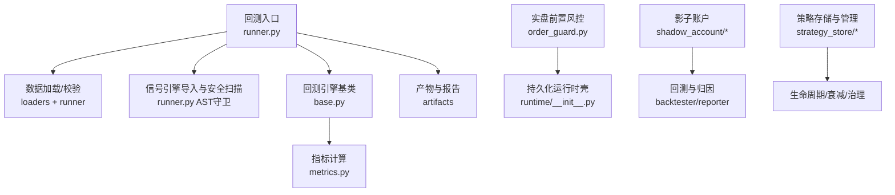
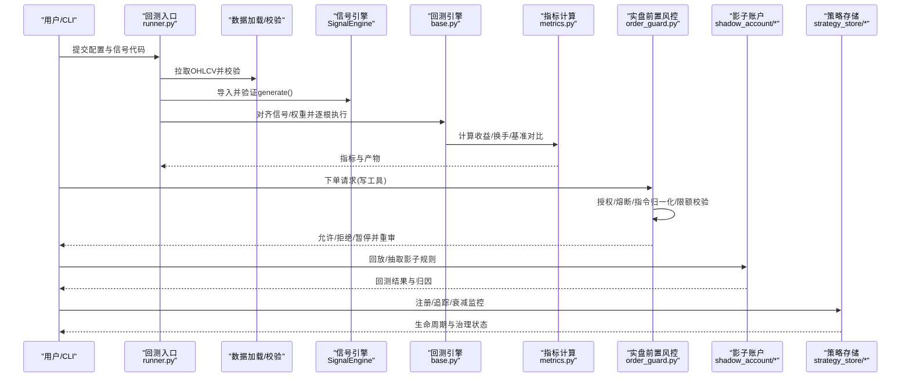
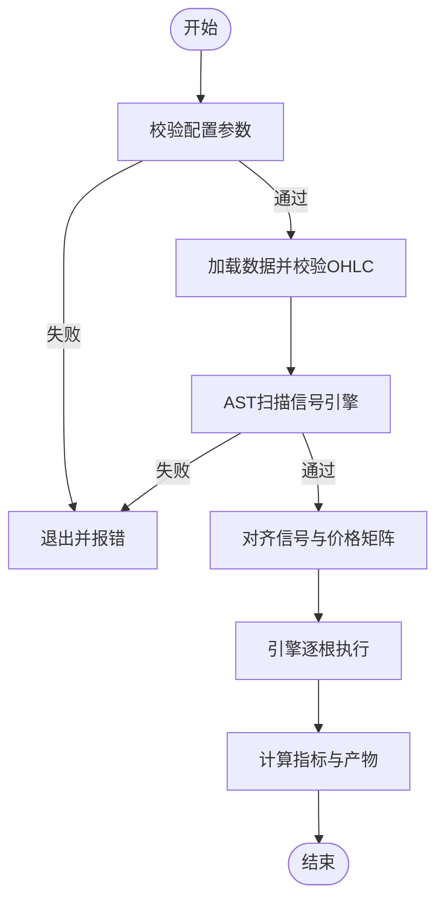
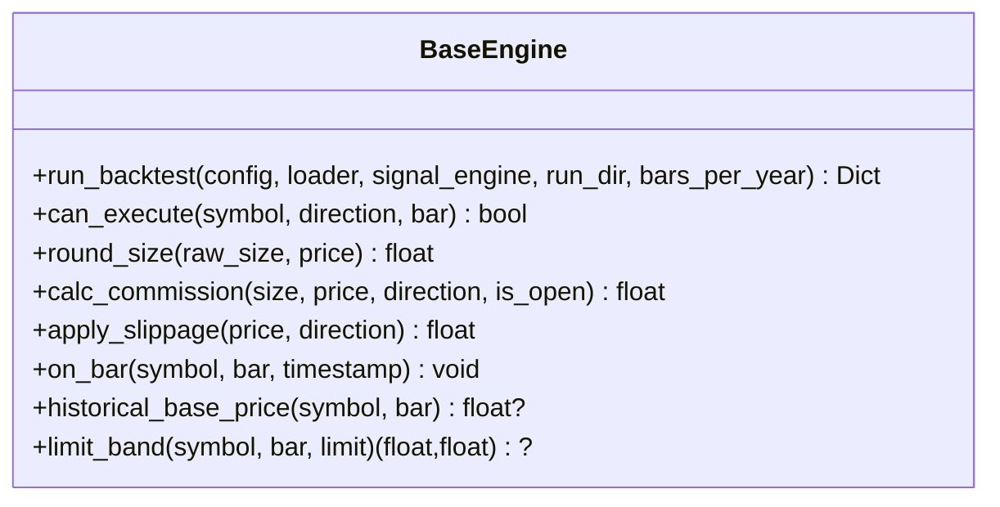
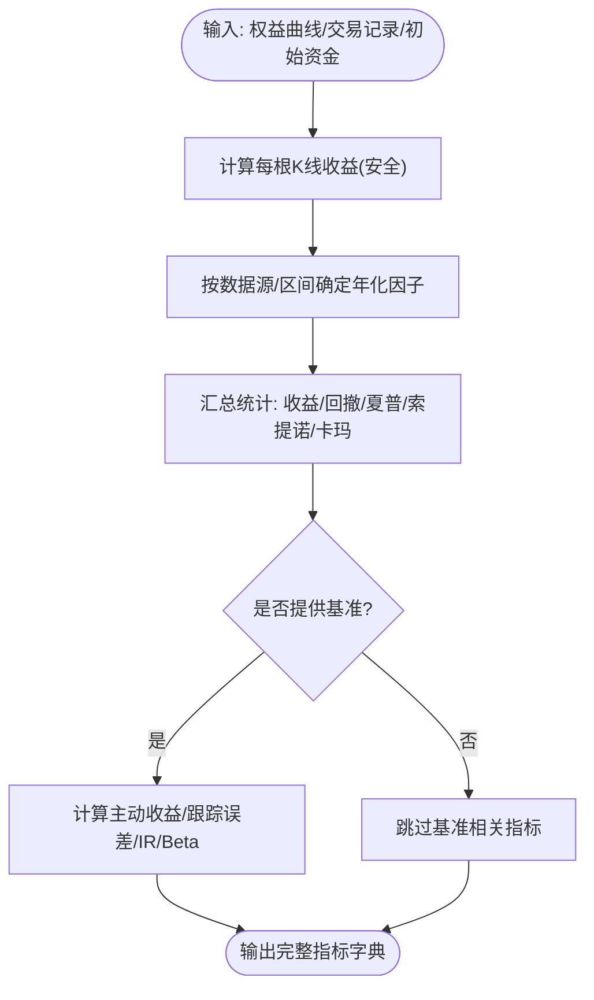
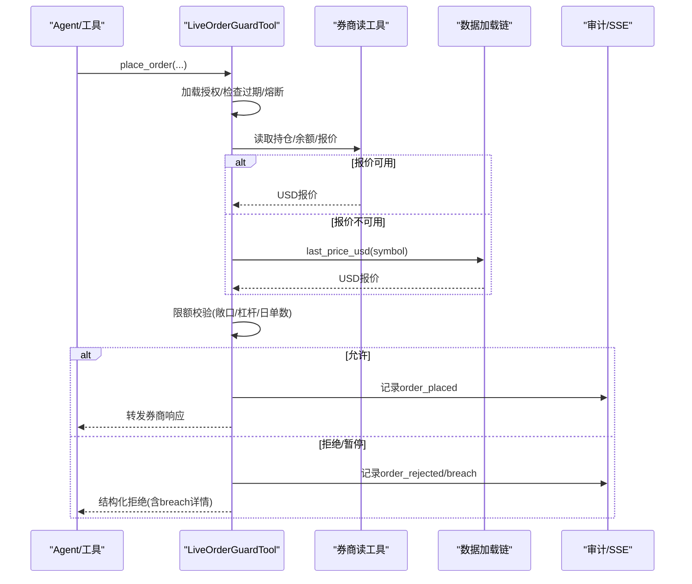
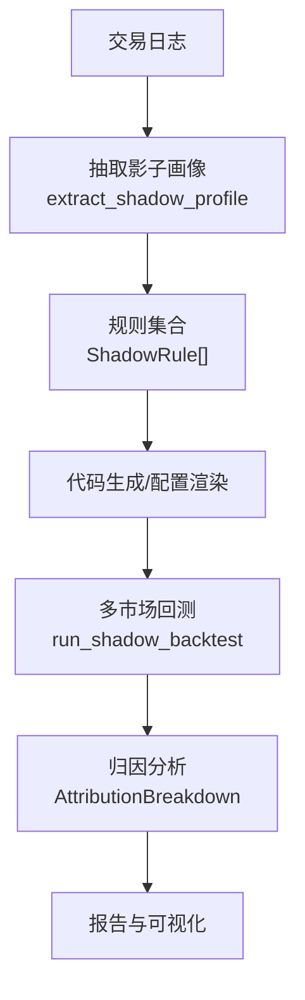
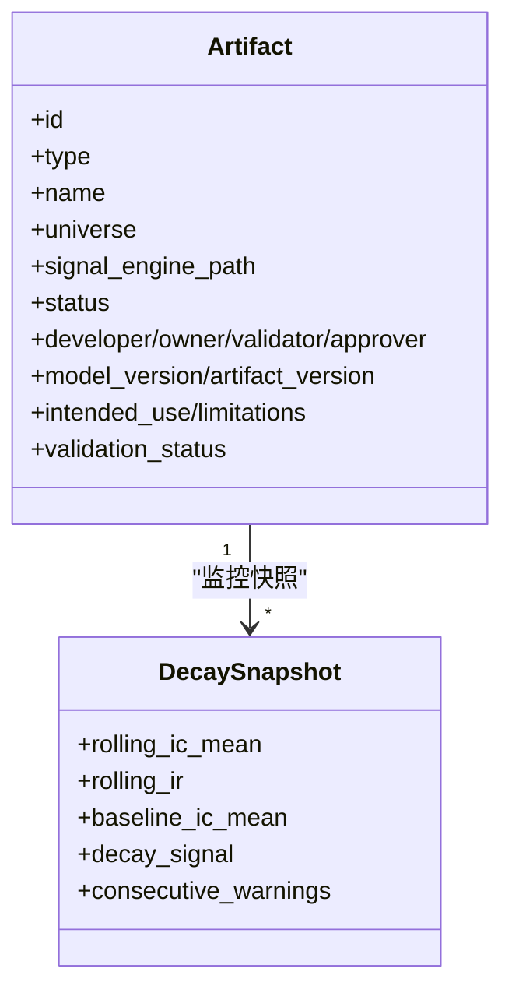
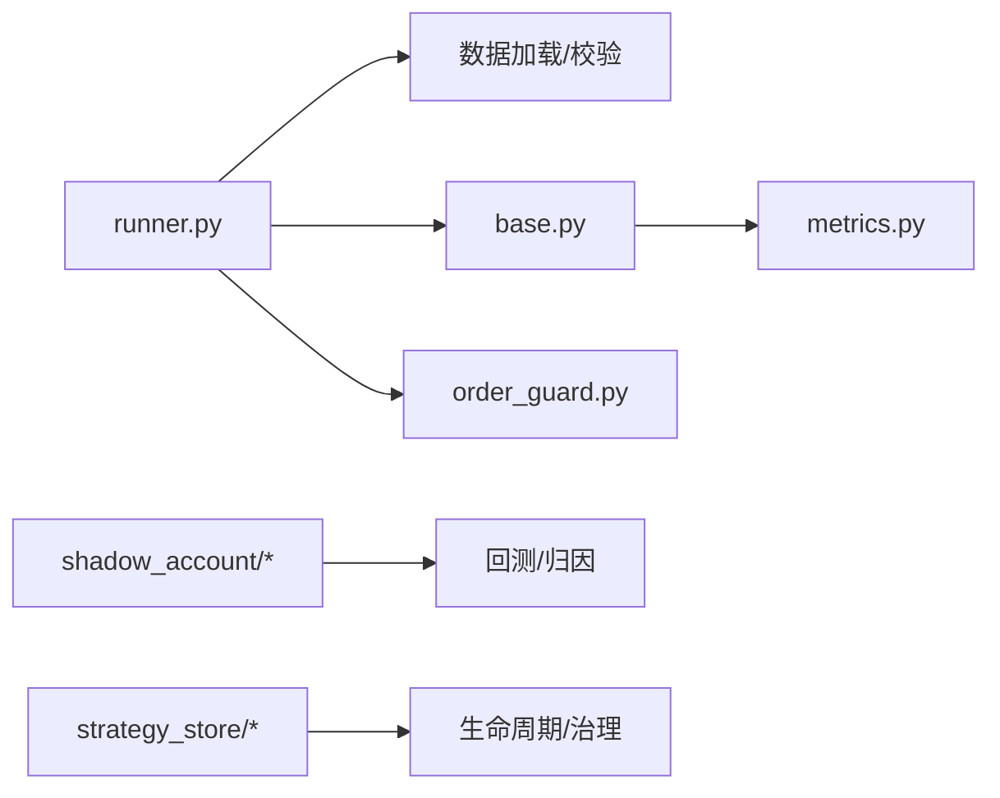

# 高级交易策略

<cite>
**本文引用的文件**
- [README.md](file://README.md)
- [runner.py](file://agent/backtest/runner.py)
- [base.py](file://agent/backtest/engines/base.py)
- [metrics.py](file://agent/backtest/metrics.py)
- [__init__.py（策略存储）](file://agent/src/strategy_store/__init__.py)
- [models.py（策略存储模型）](file://agent/src/strategy_store/models.py)
- [__init__.py（影子账户）](file://agent/src/shadow_account/__init__.py)
- [models.py（影子账户模型）](file://agent/src/shadow_account/models.py)
- [order_guard.py](file://agent/src/live/order_guard.py)
- [runtime/__init__.py](file://agent/src/live/runtime/__init__.py)
</cite>

## 目录
1. [简介](#简介)
2. [项目结构](#项目结构)
3. [核心组件](#核心组件)
4. [架构总览](#架构总览)
5. [详细组件分析](#详细组件分析)
6. [依赖关系分析](#依赖关系分析)
7. [性能与回测特性](#性能与回测特性)
8. [故障排查指南](#故障排查指南)
9. [结论](#结论)
10. [附录：高级策略案例与评估](#附录高级策略案例与评估)

## 简介
本指南面向需要开发复杂交易策略的工程师与量化研究员，覆盖统计套利、高频交易、机器学习策略、多资产组合策略等高级主题。文档基于仓库中的回测引擎、信号执行、指标计算、实盘前置风控、影子账户机制与策略存储管理，提供从信号生成、仓位管理、风险控制到执行算法与实盘订单路由的系统化说明，并给出可落地的策略案例、评估指标与压力测试方法。

## 项目结构
本项目围绕“数据→信号→执行→风控→评估”的闭环构建：
- 回测入口与配置校验：统一加载数据、导入信号引擎、运行引擎并输出指标与产物。
- 回测引擎基类：抽象市场规则（涨跌停、滑点、手续费、保证金、强平），实现按K线逐根执行的通用流程。
- 指标体系：年化因子、收益曲线、换手率、基准对比、跟踪误差、信息比率等。
- 实盘前置风控：订单前置检查、授权有效期、熔断开关、指令归一化、限额校验、审计与SSE事件。
- 影子账户：从历史成交中抽取可复现的交易画像与规则，进行跨市场回测与归因。
- 策略存储与管理：研究制品生命周期、衰减监控、版本与治理字段。

图表来源
- [runner.py:1-120](file://agent/backtest/runner.py#L1-L120)
- [base.py:652-800](file://agent/backtest/engines/base.py#L652-L800)
- [metrics.py:461-626](file://agent/backtest/metrics.py#L461-L626)
- [order_guard.py:97-215](file://agent/src/live/order_guard.py#L97-L215)
- [runtime/__init__.py:1-14](file://agent/src/live/runtime/__init__.py#L1-L14)
- [__init__.py（影子账户）:1-54](file://agent/src/shadow_account/__init__.py#L1-L54)
- [__init__.py（策略存储）:1-22](file://agent/src/strategy_store/__init__.py#L1-L22)

章节来源
- [runner.py:1-120](file://agent/backtest/runner.py#L1-L120)
- [base.py:652-800](file://agent/backtest/engines/base.py#L652-L800)
- [metrics.py:461-626](file://agent/backtest/metrics.py#L461-L626)
- [order_guard.py:97-215](file://agent/src/live/order_guard.py#L97-L215)
- [runtime/__init__.py:1-14](file://agent/src/live/runtime/__init__.py#L1-L14)
- [__init__.py（影子账户）:1-54](file://agent/src/shadow_account/__init__.py#L1-L54)
- [__init__.py（策略存储）:1-22](file://agent/src/strategy_store/__init__.py#L1-L22)

## 核心组件
- 回测入口与配置校验：负责读取配置、选择数据源、动态导入信号引擎、AST安全扫描、调用引擎执行并产出指标与产物。
- 回测引擎基类：定义统一的按K线执行循环、市场规则接口（涨跌停、滑点、手续费）、目标权重对齐、优化器接入、基准与指标计算。
- 指标计算：提供安全的收益率计算、年化因子映射、换手率、基准对比、跟踪误差与信息比率等。
- 实盘前置风控：对写操作工具进行强制前置检查，包括授权、熔断、指令解析、报价归一化、限额校验、审计与SSE事件。
- 影子账户：从交易日志提取可复现的交易画像与规则，支持多市场回测与PnL归因。
- 策略存储与管理：制品类型、状态机、衰减快照、模型治理字段与校验。

章节来源
- [runner.py:1-120](file://agent/backtest/runner.py#L1-L120)
- [base.py:377-800](file://agent/backtest/engines/base.py#L377-L800)
- [metrics.py:153-171](file://agent/backtest/metrics.py#L153-L171)
- [metrics.py:461-626](file://agent/backtest/metrics.py#L461-L626)
- [order_guard.py:97-215](file://agent/src/live/order_guard.py#L97-L215)
- [__init__.py（影子账户）:1-54](file://agent/src/shadow_account/__init__.py#L1-L54)
- [models.py（策略存储模型）:80-132](file://agent/src/strategy_store/models.py#L80-L132)

## 架构总览
下图展示从配置到信号、执行、风控与产物的端到端流程，以及影子账户与策略存储的协同。

图表来源
- [runner.py:1-120](file://agent/backtest/runner.py#L1-L120)
- [base.py:652-800](file://agent/backtest/engines/base.py#L652-L800)
- [metrics.py:461-626](file://agent/backtest/metrics.py#L461-L626)
- [order_guard.py:97-215](file://agent/src/live/order_guard.py#L97-L215)
- [__init__.py（影子账户）:1-54](file://agent/src/shadow_account/__init__.py#L1-L54)
- [__init__.py（策略存储）:1-22](file://agent/src/strategy_store/__init__.py#L1-L22)

## 详细组件分析

### 回测入口与信号安全沙箱
- 配置校验：严格校验代码列表、起止日期、区间、引擎、数据源、初始资金与基本面字段、事件流配置，确保运行前失败而非运行后崩溃。
- 信号引擎安全：通过AST静态检查禁止危险模块与属性访问，限制顶层可执行语句，仅允许纯常量赋值；对运行时可达路径进行深度扫描，阻断网络、进程、文件系统写入、动态执行与对象图遍历等风险。
- 入口职责：加载数据、导入信号、对齐信号与价格矩阵、调用引擎执行、输出指标与产物。

图表来源
- [runner.py:68-162](file://agent/backtest/runner.py#L68-L162)
- [runner.py:215-817](file://agent/backtest/runner.py#L215-L817)
- [base.py:652-724](file://agent/backtest/engines/base.py#L652-L724)

章节来源
- [runner.py:68-162](file://agent/backtest/runner.py#L68-L162)
- [runner.py:215-817](file://agent/backtest/runner.py#L215-L817)
- [base.py:652-724](file://agent/backtest/engines/base.py#L652-L724)

### 回测引擎基类与市场规则
- 统一执行循环：数据加载→信号生成→目标权重对齐（含优化器）→逐根执行→指标计算→产物输出。
- 市场规则接口：子类需实现是否可执行、手数取整、手续费、滑点、每根K线钩子（如资金费率、强平）。
- 基准与指标：可选外部基准序列，计算超额收益、跟踪误差、信息比率与Beta；换手率可从实际成交或持仓变化推导。
- 价格限制与负价：支持以历史结算价或前收盘为基准的价格带；在特定市场允许负价开盘时的安全处理。

图表来源
- [base.py:377-650](file://agent/backtest/engines/base.py#L377-L650)
- [base.py:652-800](file://agent/backtest/engines/base.py#L652-L800)

章节来源
- [base.py:377-650](file://agent/backtest/engines/base.py#L377-L650)
- [base.py:652-800](file://agent/backtest/engines/base.py#L652-L800)

### 指标与年化
- 年化因子：按数据源与区间映射每日K线数，统一分钟/小时/日区间的年化口径。
- 收益计算：对非正前价与零价场景做安全处理，避免无穷大或NaN污染累计收益。
- 完整指标集：总收益、年化收益、最大回撤、夏普、索提诺、卡玛、胜率、盈亏比、连续亏损、平均持仓期、基准收益、超额收益、信息比率、跟踪误差、Beta、换手率等。

图表来源
- [metrics.py:153-171](file://agent/backtest/metrics.py#L153-L171)
- [metrics.py:245-330](file://agent/backtest/metrics.py#L245-L330)
- [metrics.py:461-626](file://agent/backtest/metrics.py#L461-L626)

章节来源
- [metrics.py:153-171](file://agent/backtest/metrics.py#L153-L171)
- [metrics.py:245-330](file://agent/backtest/metrics.py#L245-L330)
- [metrics.py:461-626](file://agent/backtest/metrics.py#L461-L626)

### 实盘前置风控与订单路由
- 前置检查顺序：加载授权→检查过期→熔断开关→解析订单意图→将数量归一化为名义敞口（结合实时报价）→读取持仓与余额→限额校验→允许/拒绝/暂停重审。
- 报价归一化：优先使用券商报价工具，不可用时回退至数据加载链；无法获取报价则拒绝（fail-closed）。
- 审计与事件：每次决策写入审计事件，成功下单才消耗当日计数；返回结果嵌入审计摘要以便SSE推送。
- 只读工具不受限：仅对写操作工具启用前置风控，读工具保持直通。

图表来源
- [order_guard.py:97-215](file://agent/src/live/order_guard.py#L97-L215)
- [order_guard.py:216-317](file://agent/src/live/order_guard.py#L216-L317)
- [order_guard.py:364-432](file://agent/src/live/order_guard.py#L364-L432)
- [order_guard.py:514-616](file://agent/src/live/order_guard.py#L514-L616)

章节来源
- [order_guard.py:97-215](file://agent/src/live/order_guard.py#L97-L215)
- [order_guard.py:216-317](file://agent/src/live/order_guard.py#L216-L317)
- [order_guard.py:364-432](file://agent/src/live/order_guard.py#L364-L432)
- [order_guard.py:514-616](file://agent/src/live/order_guard.py#L514-L616)

### 影子账户机制（模拟与验证）
- 能力概览：从交易日志中提取可复现的“影子画像”，包含规则集合、偏好市场、典型持仓周期等；支持多市场回测与PnL归因（错失信号、噪音交易、早/晚出场、过度交易等）。
- 数据契约：稳定定义的模型（ShadowRule、ShadowProfile、AttributionBreakdown、ShadowBacktestResult）保障抽取、代码生成、回测与报告的一致性。
- 用途：用于策略模拟、规则提炼、回测对比与归因分析，辅助策略迭代与验证。

图表来源
- [__init__.py（影子账户）:1-54](file://agent/src/shadow_account/__init__.py#L1-L54)
- [models.py（影子账户模型）:20-111](file://agent/src/shadow_account/models.py#L20-L111)

章节来源
- [__init__.py（影子账户）:1-54](file://agent/src/shadow_account/__init__.py#L1-L54)
- [models.py（影子账户模型）:20-111](file://agent/src/shadow_account/models.py#L20-L111)

### 策略存储与管理（版本控制、回测对比、性能追踪）
- 制品类型与状态：因子/策略，状态涵盖创建、回测中、活跃、监控、衰减、禁用。
- 衰减监控：滚动IC/IR与基线对比，发出健康/警告/衰减/关键信号，支持连续告警计数。
- 模型治理：开发者/所有者/验证者/批准者、版本、分层、预期用途与限制、独立验证状态流转。
- 用途：支撑策略全生命周期管理、回测对比、衰减预警与合规治理。

图表来源
- [models.py（策略存储模型）:80-177](file://agent/src/strategy_store/models.py#L80-L177)

章节来源
- [__init__.py（策略存储）:1-22](file://agent/src/strategy_store/__init__.py#L1-L22)
- [models.py（策略存储模型）:80-177](file://agent/src/strategy_store/models.py#L80-L177)

## 依赖关系分析
- 回测入口依赖数据加载器与引擎基类，并通过AST守卫保证信号代码安全。
- 引擎基类依赖指标模块计算收益与换手率，并可接入优化器与约束。
- 实盘前置风控依赖授权、熔断、指令解析、报价与审计模块，形成写操作的唯一通道。
- 影子账户与策略存储作为横切能力，分别服务于策略模拟与生命周期治理。

图表来源
- [runner.py:1-120](file://agent/backtest/runner.py#L1-L120)
- [base.py:652-800](file://agent/backtest/engines/base.py#L652-L800)
- [metrics.py:461-626](file://agent/backtest/metrics.py#L461-L626)
- [order_guard.py:97-215](file://agent/src/live/order_guard.py#L97-L215)
- [__init__.py（影子账户）:1-54](file://agent/src/shadow_account/__init__.py#L1-L54)
- [__init__.py（策略存储）:1-22](file://agent/src/strategy_store/__init__.py#L1-L22)

章节来源
- [runner.py:1-120](file://agent/backtest/runner.py#L1-L120)
- [base.py:652-800](file://agent/backtest/engines/base.py#L652-L800)
- [metrics.py:461-626](file://agent/backtest/metrics.py#L461-L626)
- [order_guard.py:97-215](file://agent/src/live/order_guard.py#L97-L215)
- [__init__.py（影子账户）:1-54](file://agent/src/shadow_account/__init__.py#L1-L54)
- [__init__.py（策略存储）:1-22](file://agent/src/strategy_store/__init__.py#L1-L22)

## 性能与回测特性
- 年化与区间：按数据源与区间映射每日K线数，保证跨市场一致年化。
- 收益稳健性：对非正前价与零价场景做安全处理，避免无穷大或NaN污染累计收益。
- 换手率：支持从实际成交或持仓变化推导，便于成本与冲击评估。
- 基准对比：可配置外部基准，计算超额收益、跟踪误差与信息比率。
- 优化器与约束：支持动态加载优化器与约束框架，生成目标权重后再执行。

章节来源
- [metrics.py:153-171](file://agent/backtest/metrics.py#L153-L171)
- [metrics.py:245-330](file://agent/backtest/metrics.py#L245-L330)
- [metrics.py:461-626](file://agent/backtest/metrics.py#L461-L626)
- [base.py:358-385](file://agent/backtest/engines/base.py#L358-L385)

## 故障排查指南
- 配置错误：检查代码列表、起止日期、区间、引擎、数据源与初始资金是否符合校验规则。
- 信号引擎问题：确认generate()存在且返回类型为符号到Series的映射；若被AST守卫拒绝，检查是否存在危险导入或可执行语句。
- 数据缺失：确认数据源可用且时间范围内有重叠；若全部符号无数据，会抛出异常。
- 实盘下单被拒：查看返回的结构化拒绝原因（授权过期、熔断、限额突破、报价不可用等），必要时重新授权或调整限额。
- 指标异常：关注权益曲线是否出现零值或负值导致年化/波动异常；检查基准序列与对齐方式。

章节来源
- [runner.py:68-162](file://agent/backtest/runner.py#L68-L162)
- [runner.py:215-817](file://agent/backtest/runner.py#L215-L817)
- [base.py:652-724](file://agent/backtest/engines/base.py#L652-L724)
- [order_guard.py:514-616](file://agent/src/live/order_guard.py#L514-L616)

## 结论
本仓库提供了从信号生成、回测执行、指标计算到实盘前置风控与影子账户验证的完整技术栈。通过严格的配置校验与AST安全沙箱、标准化的引擎接口与指标体系、健壮的实盘前置风控与审计、以及策略存储的生命周期管理，能够支撑统计套利、高频交易、机器学习策略与多资产组合策略的研发与落地。建议在实际使用中结合影子账户进行策略模拟与归因，利用策略存储进行版本管理与衰减监控，并在实盘中严格执行前置风控与审计。

## 附录：高级策略案例与评估

### 统计套利（配对交易）
- 信号生成：基于价差序列的均值回归信号（如Z-score阈值触发），结合协整检验与滚动窗口估计。
- 仓位管理：按价差偏离度分配头寸，考虑波动率缩放与相关性约束。
- 风险控制：设置止损、价差发散阈值、流动性阈值与最大回撤限制。
- 执行算法：拆单与限价/市价混合，考虑滑点与冲击成本。
- 评估指标：IC/IR、夏普、最大回撤、换手率、基准对比、跟踪误差。
- 压力测试：极端行情下的价差发散、流动性枯竭、相关性破裂。

### 高频交易
- 信号生成：微观结构特征（订单簿不平衡、瞬时波动、买卖价差变动）。
- 仓位管理：极短持仓期的动态头寸调整，强调周转与成本控制。
- 风险控制：逐笔风控、熔断、延迟与丢包处理。
- 执行算法：智能拆单、冰山单、TWAP/VWAP、做市策略。
- 评估指标：滑点、冲击成本、成交率、日内收益分布、尾部风险。
- 压力测试：网络抖动、交易所限速、极端波动。

### 机器学习策略
- 信号生成：特征工程（量价、基本面、事件）、模型训练（树模型、深度学习）、标签设计（未来收益/方向）。
- 仓位管理：基于模型置信度与风险预算的头寸分配。
- 风险控制：过拟合检测、样本外验证、稳定性监控、衰减预警。
- 执行算法：批量调仓、再平衡、交易成本建模。
- 评估指标：IC/IR、预测准确率、AUC、夏普、回撤、换手率。
- 压力测试：分布漂移、概念漂移、极端市场 regime。

### 多资产组合策略
- 信号生成：多因子模型、风险平价、均值方差优化、波动率目标。
- 仓位管理：目标权重生成、约束优化（行业/风格/流动性）、再平衡频率。
- 风险控制：组合层面VaR/CVaR、集中度限制、杠杆上限、相关性突变。
- 执行算法：分批调仓、冲击成本最小化、跨市场同步。
- 评估指标：组合收益、分散化收益、跟踪误差、信息比率、最大回撤。
- 压力测试：相关性上升、流动性收缩、黑天鹅事件。

章节来源
- [metrics.py:461-626](file://agent/backtest/metrics.py#L461-L626)
- [base.py:652-800](file://agent/backtest/engines/base.py#L652-L800)
- [order_guard.py:97-215](file://agent/src/live/order_guard.py#L97-L215)
- [__init__.py（影子账户）:1-54](file://agent/src/shadow_account/__init__.py#L1-L54)
- [models.py（策略存储模型）:80-177](file://agent/src/strategy_store/models.py#L80-L177)